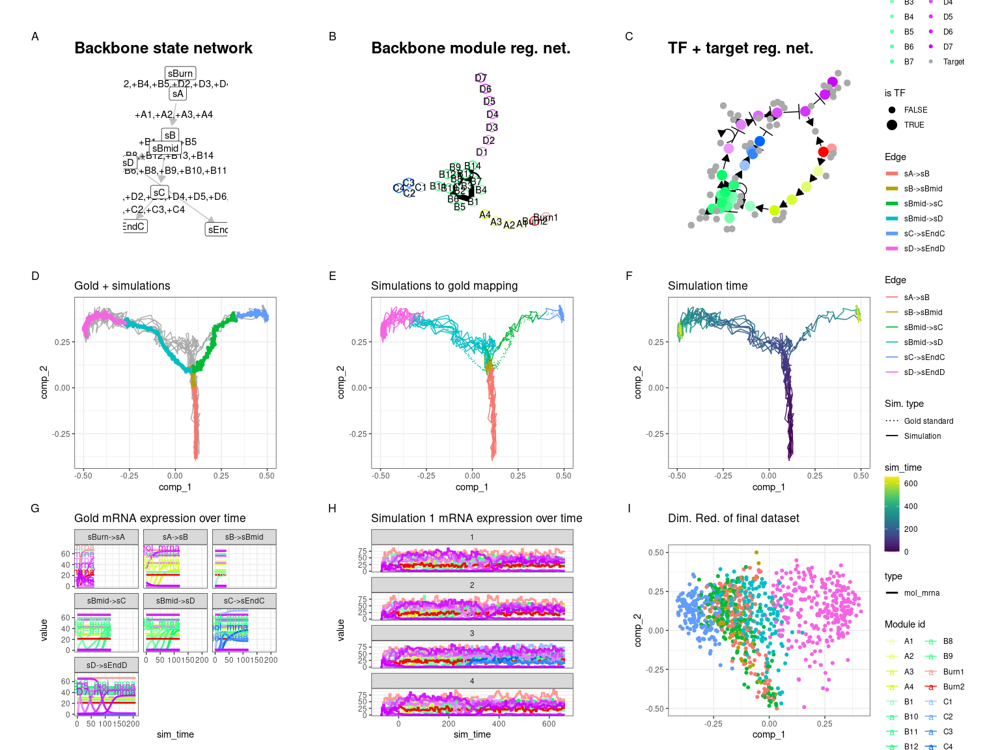
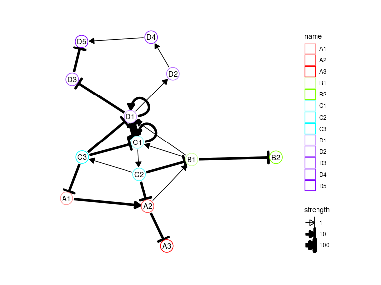
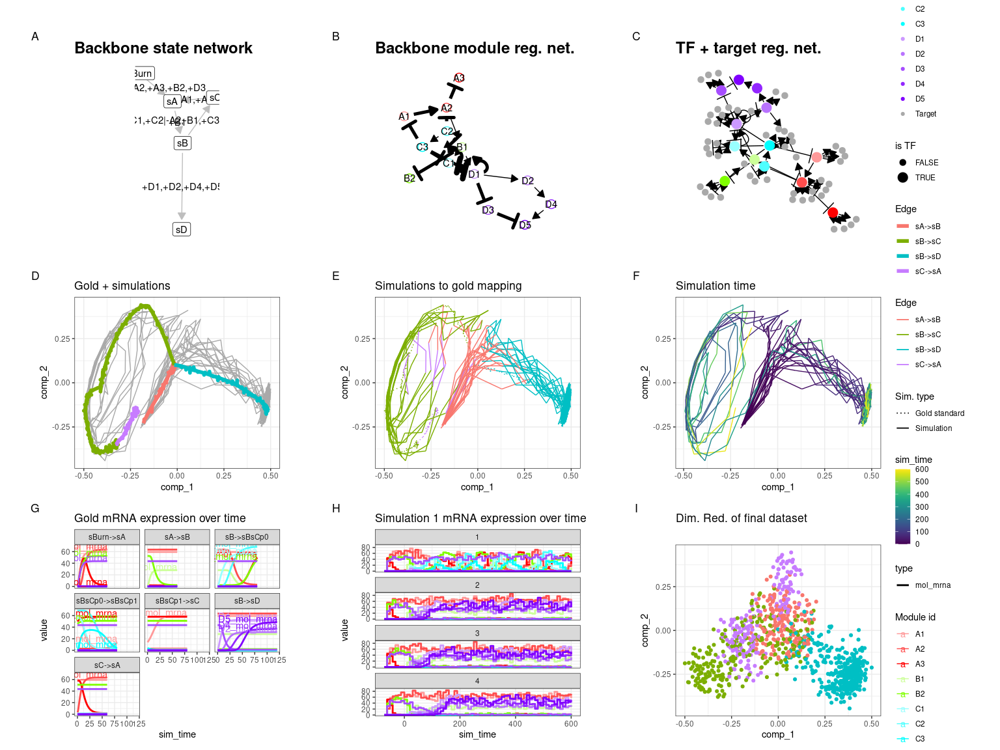
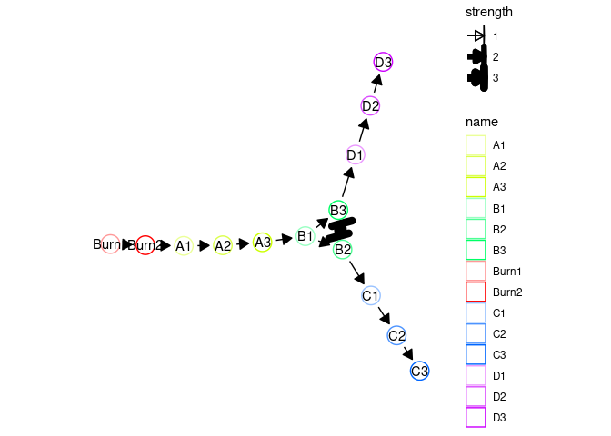
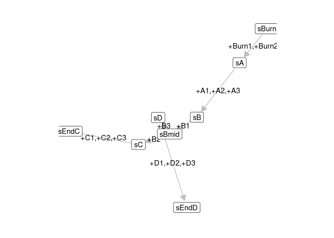
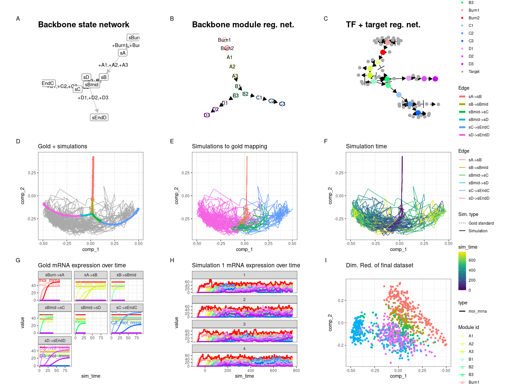
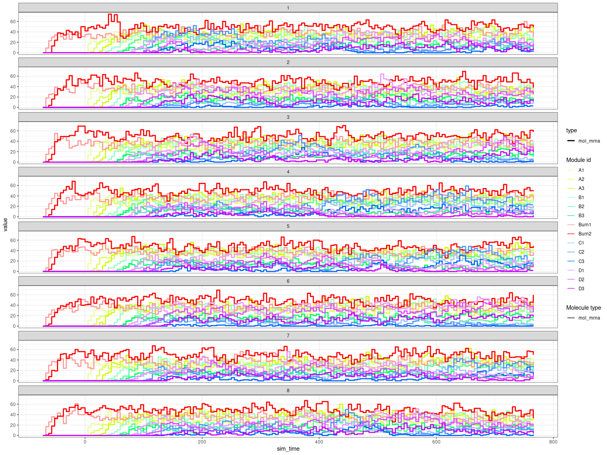

Advanced: Constructing a custom backbone
================

<!-- github markdown built using 
rmarkdown::render("vignettes/advanced_constructing_backbone.Rmd", output_format = rmarkdown::github_document())
-->

You may want to construct your own custom backbone as opposed to those
predefined in dyngen in order to obtain a desired effect. You can do so
in one of two ways.

## Backbone lego

You can use the `bblego` functions in order to create custom backbones
using so-called ‘backbone lego blocks’. Please note that `bblego` only
allows you to create tree-shaped backbones (so no cycles), but in 90% of
cases will be exactly what you need and in the remaining 10% of cases
these functions will still get you 80% of where you need to be.

Here is an example of a bifurcating trajectory.

``` r
library(dyngen)
library(tidyverse)

set.seed(1)

backbone <- bblego(
  bblego_start("A", type = "simple", num_modules = 2),
  bblego_linear("A", "B", type = "simple", num_modules = 4),
  bblego_branching("B", c("C", "D"), type = "simple"),
  bblego_end("C", type = "doublerep2", num_modules = 4),
  bblego_end("D", type = "doublerep1", num_modules = 7)
)

config <- 
  initialise_model(
    backbone = backbone,
    num_tfs = nrow(backbone$module_info),
    num_targets = 500,
    num_hks = 500,
    verbose = FALSE
  )
```

``` r
# the simulation is being sped up because rendering all vignettes with one core
# for pkgdown can otherwise take a very long time
config <- 
  initialise_model(
    backbone = backbone,
    num_tfs = nrow(backbone$module_info),
    num_targets = 50,
    num_hks = 50,
    verbose = interactive(),
    simulation_params = simulation_default(
      ssa_algorithm = ssa_etl(tau = .01),
      census_interval = 5,
      experiment_params = simulation_type_wild_type(num_simulations = 10)
    ),
    download_cache_dir = tools::R_user_dir("dyngen", "data")
  )
```

``` r
out <- generate_dataset(config, make_plots = TRUE)
```

    ## Generating TF network
    ## Sampling feature network from real network
    ## Generating kinetics for 131 features
    ## Generating formulae
    ## Generating gold standard mod changes
    ## Precompiling reactions for gold standard
    ## Running gold simulations
    ##   |                                                  | 0 % elapsed=00s     |========                                          | 14% elapsed=00s, remaining~00s  |===============                                   | 29% elapsed=00s, remaining~00s  |======================                            | 43% elapsed=00s, remaining~00s  |=============================                     | 57% elapsed=00s, remaining~00s  |====================================              | 71% elapsed=00s, remaining~00s  |===========================================       | 86% elapsed=00s, remaining~00s  |==================================================| 100% elapsed=01s, remaining~00s
    ## Precompiling reactions for simulations
    ## Running 10 simulations
    ## Mapping simulations to gold standard
    ## Performing dimred
    ## Simulating experiment
    ## Wrapping dataset
    ## Making plots

``` r
print(out$plot)
```

<!-- -->

Check the following predefined backbones for some examples.

-   [backbone\_bifurcating](https://github.com/dynverse/dyngen/blob/master/R/0d_backbones.R#L3-L11)
-   [backbone\_branching](https://github.com/dynverse/dyngen/blob/master/R/0d_backbones.R#L195-L273)
-   [backbone\_linear](https://github.com/dynverse/dyngen/blob/master/R/0d_backbones.R#L420-L427)

## Manually constructing backbone data frames

To get the most control over how a dyngen simulation is performed, you
can construct a backbone manually (see `?backbone` for the full spec).
This is the only way to create some of the more specific backbone shapes
such as disconnected, cyclic and converging.

This is an example of what data structures a backbone consists of.

### Module info

A tibble containing meta information on the modules themselves. A module
is a group of genes which, to some extent, shows the same expression
behaviour. Several modules are connected together such that one or more
genes from one module will regulate the expression of another module. By
creating chains of modules, a dynamic behaviour in gene regulation can
be created.

-   module\_id (character): the name of the module
-   basal (numeric): basal expression level of genes in this module,
    must be between \[0, 1\]
-   burn (logical): whether or not outgoing edges of this module will be
    active during the burn in phase
-   independence (numeric): the independence factor between regulators
    of this module, must be between \[0, 1\]

``` r
module_info <- tribble(
  ~module_id, ~basal, ~burn, ~independence,
  "A1", 1, TRUE, 1,
  "A2", 0, TRUE, 1,
  "A3", 1, TRUE, 1,
  "B1", 0, FALSE, 1,
  "B2", 1, TRUE, 1,
  "C1", 0, FALSE, 1,
  "C2", 0, FALSE, 1,
  "C3", 0, FALSE, 1,
  "D1", 0, FALSE, 1,
  "D2", 0, FALSE, 1,
  "D3", 1, TRUE, 1,
  "D4", 0, FALSE, 1,
  "D5", 0, FALSE, 1
)
```

### Module network

A tibble describing which modules regulate which other modules.

-   from (character): the regulating module
-   to (character): the target module
-   effect (integer): 1L if the regulating module upregulates the target
    module, -1L if it downregulates
-   strength (numeric): the strength of the interaction
-   hill (numeric): hill coefficient, larger than 1 for positive
    cooperativity, between 0 and 1 for negative cooperativity

``` r
module_network <- tribble(
  ~from, ~to, ~effect, ~strength, ~hill,
  "A1", "A2", 1L, 10, 2,
  "A2", "A3", -1L, 10, 2,
  "A2", "B1", 1L, 1, 2,
  "B1", "B2", -1L, 10, 2,
  "B1", "C1", 1L, 1, 2,
  "B1", "D1", 1L, 1, 2,
  "C1", "C1", 1L, 10, 2,
  "C1", "D1", -1L, 100, 2,
  "C1", "C2", 1L, 1, 2,
  "C2", "C3", 1L, 1, 2,
  "C2", "A2", -1L, 10, 2,
  "C2", "B1", -1L, 10, 2,
  "C3", "A1", -1L, 10, 2,
  "C3", "C1", -1L, 10, 2,
  "C3", "D1", -1L, 10, 2,
  "D1", "D1", 1L, 10, 2,
  "D1", "C1", -1L, 100, 2,
  "D1", "D2", 1L, 1, 2,
  "D1", "D3", -1L, 10, 2,
  "D2", "D4", 1L, 1, 2,
  "D4", "D5", 1L, 1, 2,
  "D3", "D5", -1L, 10, 2
)
```

### Expression patterns

A tibble describing the expected expression pattern changes when a cell
is simulated by dyngen. Each row represents one transition between two
cell states.

-   from (character): name of a cell state
-   to (character): name of a cell state
-   module\_progression (character): differences in module expression
    between the two states. Example: “+4,-1\|+9\|-4” means the
    expression of module 4 will go up at the same time as module 1 goes
    down; afterwards module 9 expression will go up, and afterwards
    module 4 expression will go down again.
-   start (logical): Whether or not this from cell state is the start of
    the trajectory
-   burn (logical): Whether these cell states are part of the burn in
    phase. Cells will not get sampled from these cell states.
-   time (numeric): The duration of an transition.

``` r
expression_patterns <- tribble(
  ~from, ~to, ~module_progression, ~start, ~burn, ~time,
  "sBurn", "sA", "+A1,+A2,+A3,+B2,+D3", TRUE, TRUE, 60,
  "sA", "sB", "+B1", FALSE, FALSE, 60,
  "sB", "sC", "+C1,+C2|-A2,-B1,+C3|-C1,-D1,-D2", FALSE, FALSE, 80,
  "sB", "sD", "+D1,+D2,+D4,+D5", FALSE, FALSE, 120,
  "sC", "sA", "+A1,+A2", FALSE, FALSE, 60
)
```

### Visualising the backbone

By wrapping these data structures as a backbone object, we can now
visualise the topology of the backbone. Drawing the backbone module
network by hand on a piece of paper can help you understand how the gene
regulatory network works.

``` r
backbone <- backbone(
  module_info = module_info,
  module_network = module_network,
  expression_patterns = expression_patterns
)

config <- initialise_model(
  backbone = backbone,
  num_tfs = nrow(backbone$module_info),
  num_targets = 500,
  num_hks = 500,
  simulation_params = simulation_default(
    experiment_params = simulation_type_wild_type(num_simulations = 100),
    total_time = 600
  ),
  verbose = FALSE
)

plot_backbone_modulenet(config)
```

<!-- -->

``` r
plot_backbone_statenet(config)
```

<!-- -->

``` r
# the simulation is being sped up because rendering all vignettes with one core
# for pkgdown can otherwise take a very long time
config <- 
  initialise_model(
    backbone = backbone,
    num_tfs = nrow(backbone$module_info),
    num_targets = 50,
    num_hks = 50,
    verbose = interactive(),
    simulation_params = simulation_default(
      ssa_algorithm = ssa_etl(tau = .01),
      census_interval = 10,
      experiment_params = simulation_type_wild_type(num_simulations = 20),
      total_time = 600
    ),
    download_cache_dir = tools::R_user_dir("dyngen", "data")
  )
```

### Simulation

This allows you to simulate the following dataset.

``` r
out <- generate_dataset(config, make_plots = TRUE)
```

    ## Generating TF network
    ## Sampling feature network from real network
    ## Generating kinetics for 113 features
    ## Generating formulae
    ## Generating gold standard mod changes
    ## Precompiling reactions for gold standard
    ## Running gold simulations
    ##   |                                                  | 0 % elapsed=00s     |========                                          | 14% elapsed=00s, remaining~00s  |===============                                   | 29% elapsed=00s, remaining~00s  |======================                            | 43% elapsed=00s, remaining~00s  |=============================                     | 57% elapsed=00s, remaining~00s  |====================================              | 71% elapsed=00s, remaining~00s  |===========================================       | 86% elapsed=00s, remaining~00s  |==================================================| 100% elapsed=00s, remaining~00s
    ## Precompiling reactions for simulations
    ## Running 20 simulations
    ## Mapping simulations to gold standard
    ## Performing dimred
    ## Simulating experiment
    ## Wrapping dataset
    ## Making plots

``` r
print(out$plot)
```

<!-- -->

### More information

dyngen has a lot of predefined backbones. The following predefined
backbones construct the backbone manually (as opposed to using bblego).

-   [backbone\_bifurcating\_converging](https://github.com/dynverse/dyngen/blob/master/R/0d_backbones.R#L16-L61)
-   [backbone\_bifurcating\_cycle](https://github.com/dynverse/dyngen/blob/master/R/0d_backbones.R#L66-L127)
-   [backbone\_bifurcating\_loop](https://github.com/dynverse/dyngen/blob/master/R/0d_backbones.R#L132-L186)
-   [backbone\_binary\_tree](https://github.com/dynverse/dyngen/blob/master/R/0d_backbones.R#L278-L282)
-   [backbone\_consecutive\_bifurcating](https://github.com/dynverse/dyngen/blob/master/R/0d_backbones.R#L287-L289)
-   [backbone\_converging](https://github.com/dynverse/dyngen/blob/master/R/0d_backbones.R#L299-L349)
-   [backbone\_cycle](https://github.com/dynverse/dyngen/blob/master/R/0d_backbones.R#L353-L384)
-   [backbone\_cycle\_simple](https://github.com/dynverse/dyngen/blob/master/R/0d_backbones.R#L388-L416)
-   [backbone\_disconnected](https://github.com/dynverse/dyngen/blob/master/R/0d_backbones.R#L468-L572)
-   [backbone\_linear\_simple](https://github.com/dynverse/dyngen/blob/master/R/0d_backbones.R#L432-L457)
-   [backbone\_trifurcating](https://github.com/dynverse/dyngen/blob/master/R/0d_backbones.R#L293-L295)

## Combination of bblego and manual

You can also use parts of the ‘bblego’ framework to construct a backbone
manually. That’s because the bblego functions simply generate the three
data frames (`module_info`, `module_network` and `expression_patterns`)
required to construct a backbone manually. For example:

``` r
part0 <- bblego_start("A", type = "simple", num_modules = 2)
part1 <- bblego_linear("A", "B", type = "simple", num_modules = 3)
part3 <- bblego_end("C", type = "simple", num_modules = 3)
part4 <- bblego_end("D", type = "simple", num_modules = 3)

part1
```

    ## $module_info
    ## # A tibble: 3 x 4
    ##   module_id basal burn  independence
    ##   <chr>     <dbl> <lgl>        <dbl>
    ## 1 A1            0 FALSE            1
    ## 2 A2            0 FALSE            1
    ## 3 A3            0 FALSE            1
    ## 
    ## $module_network
    ## # A tibble: 3 x 5
    ##   from  to    effect strength  hill
    ##   <chr> <chr>  <int>    <dbl> <dbl>
    ## 1 A1    A2         1        1     2
    ## 2 A2    A3         1        1     2
    ## 3 A3    B1         1        1     2
    ## 
    ## $expression_patterns
    ## # A tibble: 1 x 6
    ##   from  to    module_progression start burn   time
    ##   <chr> <chr> <chr>              <lgl> <lgl> <dbl>
    ## 1 sA    sB    +A1,+A2,+A3        FALSE FALSE    90

You can combine these components with a custom bifurcation component
which can switch back and forth between end states.

``` r
part2 <- list(
  module_info = tribble(
    ~module_id, ~basal, ~burn, ~independence,
    "B1", 0, FALSE, 1,
    "B2", 0, FALSE, 1,
    "B3", 0, FALSE, 1
  ),
  module_network = tribble(
    ~from, ~to, ~effect, ~strength, ~hill,
    "B1", "B2", 1L, 1, 2,
    "B1", "B3", 1L, 1, 2,
    "B2", "B3", -1L, 3, 2,
    "B3", "B2", -1L, 3, 2,
    "B2", "C1", 1L, 1, 2,
    "B3", "D1", 1L, 1, 2
  ),
  expression_patterns = tribble(
    ~from, ~to, ~module_progression, ~start, ~burn, ~time,
    "sB", "sBmid", "+B1", FALSE, FALSE, 40,
    "sBmid", "sC", "+B2", FALSE, FALSE, 40,
    "sBmid", "sD", "+B3", FALSE, FALSE, 30
  )
)

backbone <- bblego(
  part0,
  part1,
  part2,
  part3,
  part4
)

config <- initialise_model(
  backbone = backbone,
  num_tfs = nrow(backbone$module_info),
  num_targets = 500,
  num_hks = 500,
  simulation_params = simulation_default(
    total_time = simtime_from_backbone(backbone) * 2
  ),
  verbose = FALSE
)

plot_backbone_modulenet(config)
```

<!-- -->

``` r
plot_backbone_statenet(config)
```

<!-- -->

``` r
# the simulation is being sped up because rendering all vignettes with one core
# for pkgdown can otherwise take a very long time
config <- 
  initialise_model(
    backbone = backbone,
    num_tfs = nrow(backbone$module_info),
    num_targets = 50,
    num_hks = 50,
    verbose = interactive(),
    simulation_params = simulation_default(
      ssa_algorithm = ssa_etl(tau = .01),
      census_interval = 5,
      experiment_params = simulation_type_wild_type(num_simulations = 10),
      total_time = simtime_from_backbone(backbone) * 2
    ),
    download_cache_dir = tools::R_user_dir("dyngen", "data")
  )
```

Looking at the gene expression over time shows that a simulation can
indeed switch between C3 and D3 expression.

``` r
out <- generate_dataset(config, make_plots = TRUE)
```

    ## Generating TF network
    ## Sampling feature network from real network
    ## Generating kinetics for 114 features
    ## Generating formulae
    ## Generating gold standard mod changes
    ## Precompiling reactions for gold standard
    ## Running gold simulations
    ##   |                                                  | 0 % elapsed=00s     |========                                          | 14% elapsed=00s, remaining~00s  |===============                                   | 29% elapsed=00s, remaining~00s  |======================                            | 43% elapsed=00s, remaining~00s  |=============================                     | 57% elapsed=00s, remaining~00s  |====================================              | 71% elapsed=00s, remaining~00s  |===========================================       | 86% elapsed=00s, remaining~00s  |==================================================| 100% elapsed=00s, remaining~00s
    ## Precompiling reactions for simulations
    ## Running 10 simulations
    ## Mapping simulations to gold standard

    ## Warning in .generate_cells_predict_state(model): Simulation does not contain all gold standard edges. This simulation likely suffers from bad kinetics; choose a different seed and rerun.

    ## Performing dimred
    ## Simulating experiment
    ## Wrapping dataset
    ## Making plots

``` r
print(out$plot)
```

<!-- -->

``` r
plot_simulation_expression(out$model, simulation_i = 1:8, what = "mol_mrna")
```

<!-- -->
