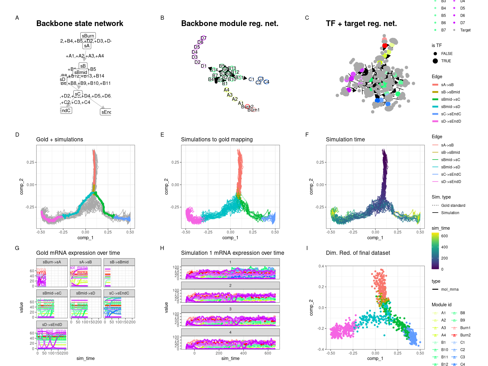

Advanced: Construct your own backbone
================

<!-- github markdown built using 
rmarkdown::render("vignettes/advanced_constructing_backbone.Rmd", output_format = rmarkdown::github_document(html_preview = FALSE))
-->

You may want to construct your own custom backbone as opposed to those
predefined in dyngen in order to obtain a desired effect. You can do so
in one of two ways.

### Backbone lego

You can use the `bblego` functions in order to create custom backbones
using so-called ‘backbone lego blocks’. Please note that `bblego` only
allows you to create tree-shaped backbones (so no cycles), but in 90% of
cases will be exactly what you need and in the remaining 10% of cases
these functions will still get you 80% of where you need to be.

Here is an example of a bifurcating trajectory.

``` r
library(dyngen)

backbone <- bblego(
  bblego_start("A", type = "simple", num_modules = 2),
  bblego_linear("A", "B", type = "flipflop", num_modules = 4),
  bblego_branching("B", c("C", "D"), type = "simple"),
  bblego_end("C", type = "doublerep2", num_modules = 4),
  bblego_end("D", type = "doublerep1", num_modules = 7)
)

out <- 
  initialise_model(
    backbone = backbone,
    num_tfs = 40,
    num_targets = 0,
    num_hks = 0,
    verbose = FALSE
  ) %>% 
  generate_dataset(make_plots = TRUE)
```

    ## Warning in .generate_cells_predict_state(model): Simulation does not contain all gold standard edges. This simulation likely suffers from bad kinetics; choose a different seed and rerun.

``` r
print(out$plot)
```

<!-- -->

Check the following predefined backbones for some examples.

-   [backbone\_bifurcating](https://github.com/dynverse/dyngen/blob/master/R/2c_backbones.R#L3-L11)
-   [backbone\_branching](https://github.com/dynverse/dyngen/blob/master/R/2c_backbones.R#L195-L273)
-   [backbone\_linear](https://github.com/dynverse/dyngen/blob/master/R/2c_backbones.R#L420-L427)

### Manually constructing backbone data frames

To get the most control over how a dyngen simulation is performed, you
can construct a backbone manually (see `?backbone` for the full spec).
This is the only way to create some of the more specific backbone shapes
such as disconnected, cyclic and converging.

This is an example of what data structures a backbone consists of.

``` r
backbone <- backbone_bifurcating_loop()

print(backbone$module_info)
```

    ## # A tibble: 13 x 5
    ##    module_id basal burn  independence color  
    ##    <chr>     <dbl> <lgl>        <dbl> <chr>  
    ##  1 A1            1 TRUE             1 #FF9999
    ##  2 A2            0 TRUE             1 #FF4D4D
    ##  3 A3            1 TRUE             1 #FF0000
    ##  4 B1            0 FALSE            1 #CCFF99
    ##  5 B2            1 TRUE             1 #80FF00
    ##  6 C1            0 FALSE            1 #99FFFF
    ##  7 C2            0 FALSE            1 #4DFFFF
    ##  8 C3            0 FALSE            1 #00FFFF
    ##  9 D1            0 FALSE            1 #CC99FF
    ## 10 D2            0 FALSE            1 #B973FF
    ## 11 D3            1 TRUE             1 #A64DFF
    ## 12 D4            0 FALSE            1 #9326FF
    ## 13 D5            0 FALSE            1 #8000FF

``` r
print(backbone$module_network)
```

    ## # A tibble: 22 x 5
    ##    from  to    effect strength  hill
    ##    <chr> <chr>  <int>    <dbl> <dbl>
    ##  1 A1    A2         1       10     2
    ##  2 A2    A3        -1       10     2
    ##  3 A2    B1         1        1     2
    ##  4 B1    B2        -1       10     2
    ##  5 B1    C1         1        1     2
    ##  6 B1    D1         1        1     2
    ##  7 C1    C1         1       10     2
    ##  8 C1    D1        -1      100     2
    ##  9 C1    C2         1        1     2
    ## 10 C2    C3         1        1     2
    ## # … with 12 more rows

``` r
print(backbone$expression_patterns)
```

    ## # A tibble: 5 x 6
    ##   from  to    module_progression              start burn   time
    ##   <chr> <chr> <chr>                           <lgl> <lgl> <dbl>
    ## 1 sBurn sA    +A1,+A2,+A3,+B2,+D3             TRUE  TRUE     60
    ## 2 sA    sB    +B1                             FALSE FALSE    60
    ## 3 sB    sC    +C1,+C2|-A2,-B1,+C3|-C1,-D1,-D2 FALSE FALSE    80
    ## 4 sB    sD    +D1,+D2,+D4,+D5                 FALSE FALSE   120
    ## 5 sC    sA    +A1,+A2                         FALSE FALSE    60

This allows you to simulate the following dataset.

``` r
out <- 
  initialise_model(
    backbone = backbone,
    num_tfs = 40,
    num_targets = 0,
    num_hks = 0,
    verbose = FALSE
  ) %>% 
  generate_dataset(make_plots = TRUE)
```

``` r
print(out$plot)
```

<!-- -->

Check the following predefined backbones for some examples.

-   [backbone\_bifurcating\_converging](https://github.com/dynverse/dyngen/blob/master/R/2c_backbones.R#L16-L61)
-   [backbone\_bifurcating\_cycle](https://github.com/dynverse/dyngen/blob/master/R/2c_backbones.R#L66-L127)
-   [backbone\_bifurcating\_loop](https://github.com/dynverse/dyngen/blob/master/R/2c_backbones.R#L132-L186)
-   [backbone\_binary\_tree](https://github.com/dynverse/dyngen/blob/master/R/2c_backbones.R#L278-L282)
-   [backbone\_consecutive\_bifurcating](https://github.com/dynverse/dyngen/blob/master/R/2c_backbones.R#L287-L289)
-   [backbone\_converging](https://github.com/dynverse/dyngen/blob/master/R/2c_backbones.R#L299-L349)
-   [backbone\_cycle](https://github.com/dynverse/dyngen/blob/master/R/2c_backbones.R#L353-L384)
-   [backbone\_cycle\_simple](https://github.com/dynverse/dyngen/blob/master/R/2c_backbones.R#L388-L416)
-   [backbone\_disconnected](https://github.com/dynverse/dyngen/blob/master/R/2c_backbones.R#L468-L572)
-   [backbone\_linear\_simple](https://github.com/dynverse/dyngen/blob/master/R/2c_backbones.R#L432-L457)
-   [backbone\_trifurcating](https://github.com/dynverse/dyngen/blob/master/R/2c_backbones.R#L293-L295)
