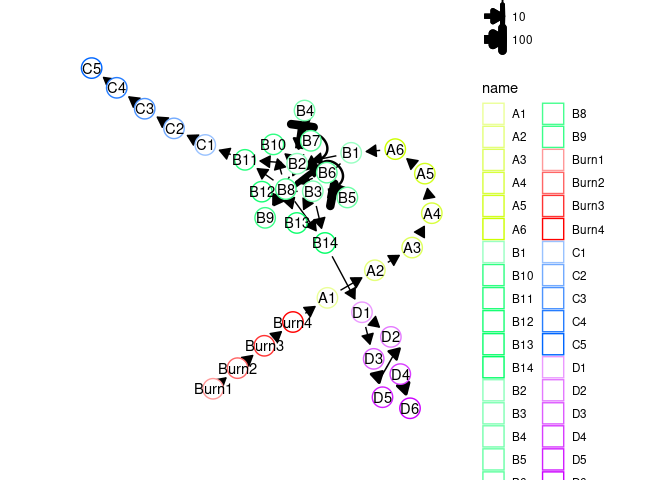
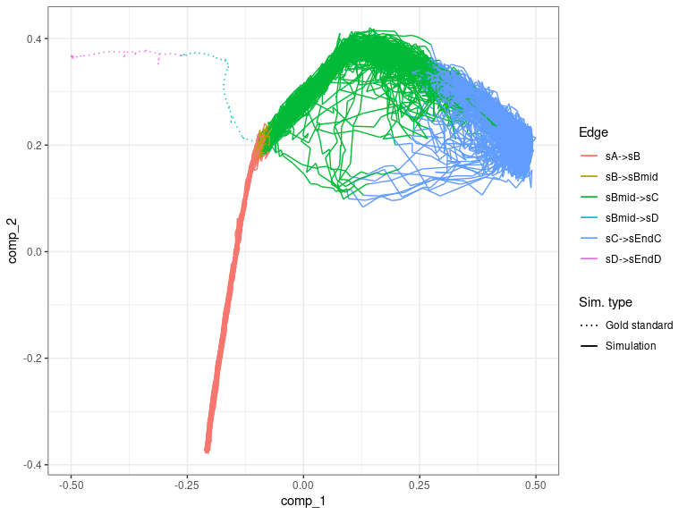
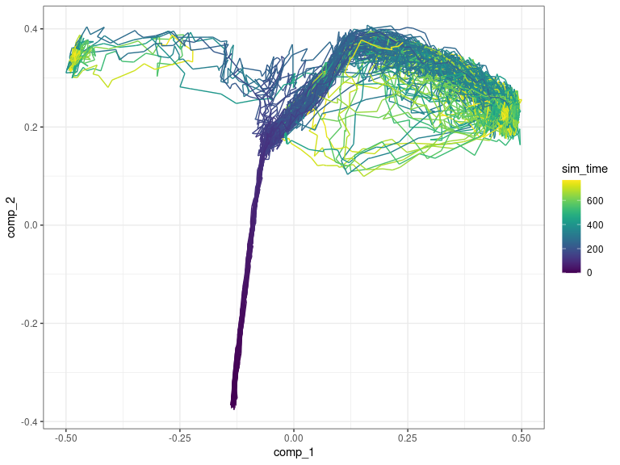

Advanced: Simulating a knockout experiment
================

<!-- github markdown built using 
rmarkdown::render("vignettes/advanced_simulating_knockouts.Rmd", output_format = rmarkdown::github_document())
-->

dyngen supports simulating knockout (or knockdown) experiments. In this
experiment, dyngen is run twice (similar to the vignette on simulating
batch effects), once for the wild type (WT), and once for the knockout
(KO).

## Initialising the experiment

First, create the ‘common’ part of the dyngen simulation as follows.
This will ensure that the gene regulatory network-part of the simulation
is exactly the same.

``` r
library(tidyverse)
library(dyngen)

set.seed(1)

backbone <- backbone_bifurcating()

config <-
  initialise_model(
    backbone = backbone,
    num_cells = 1000,
    num_tfs = nrow(backbone$module_info),
    num_targets = 250,
    num_hks = 250,
    simulation_params = simulation_default(
      census_interval = 10, 
      ssa_algorithm = ssa_etl(tau = 300 / 3600),
      experiment_params = simulation_type_wild_type(num_simulations = 100)
    )
  )
```

``` r
# the simulation is being sped up because rendering all vignettes with one core
# for pkgdown can otherwise take a very long time
set.seed(1)

config <-
  initialise_model(
    backbone = backbone,
    num_cells = 1000,
    num_tfs = nrow(backbone$module_info),
    num_targets = 50,
    num_hks = 50,
    verbose = interactive(),
    download_cache_dir = tools::R_user_dir("dyngen", "data"),
    simulation_params = simulation_default(
      census_interval = 5, 
      ssa_algorithm = ssa_etl(tau = 300/3600),
      experiment_params = simulation_type_wild_type(num_simulations = 10)
    )
  )
```

``` r
model_common <-
  config %>%
  generate_tf_network() %>%
  generate_feature_network() %>% 
  generate_kinetics() %>%
  generate_gold_standard()
```

    ## Generating TF network
    ## Sampling feature network from real network
    ## Generating kinetics for 135 features
    ## Generating formulae
    ## Generating gold standard mod changes
    ## Precompiling reactions for gold standard
    ## Running gold simulations
    ##   |                                                  | 0 % elapsed=00s     |========                                          | 14% elapsed=00s, remaining~01s  |===============                                   | 29% elapsed=00s, remaining~01s  |======================                            | 43% elapsed=00s, remaining~00s  |=============================                     | 57% elapsed=00s, remaining~00s  |====================================              | 71% elapsed=00s, remaining~00s  |===========================================       | 86% elapsed=01s, remaining~00s  |==================================================| 100% elapsed=01s, remaining~00s

## Simulate wild type

Simulating the wild type is easy, as it is the standard dyngen way of
simulating cells.

``` r
model_wt <- model_common %>%
  generate_cells()
```

    ## Precompiling reactions for simulations
    ## Running 10 simulations
    ## Mapping simulations to gold standard
    ## Performing dimred

``` r
plot_gold_mappings(model_wt, do_facet = FALSE)
```

<!-- -->

## Simulate knockout

To simulate a gene knockout, the experiment type of the simulation is
changed from wild type (see first code block) to knockdown. The
`simulation_type_knockdown()` function is actually designed to perform
single-cell knockdowns of 1 to 5 random genes, but this behaviour can be
overridden by setting the following parameters:

-   `genes`: list of gene ids to be knocked out,
-   `num_genes`: number of genes to be knocked out per cell (sampled
    randomly),
-   `multiplier`: the fraction of transcription rate after KO (0 → no
    transcription, 1 → no KO).

In this case, looking at the module network of the bifurcation model it
is possible to see that the B3 gene module is important for
diversification of cells towards one particular cell lineage (to verify,
one can draw out `model_common$module_network` on paper).

``` r
plot_backbone_modulenet(model_common)
```

<!-- -->

``` r
b3_genes <- model_common$feature_info %>% filter(module_id == "B3") %>% pull(feature_id)
```

By knocking out the gene "", one of the two branches will be inhibited.

``` r
model_ko <- model_common
model_ko$simulation_params$experiment_params <- simulation_type_knockdown(
  num_simulations = 100L,
  timepoint = 0, 
  genes = b3_genes,
  num_genes = length(b3_genes),
  multiplier = 0
)
```

Running the simulation will generate a warning stating that some of the
gold standard edges were not covered by any of the simulations, but
that’s to be expected since we knocked it out. We can see that indeed no
simulation managed to enter the second branch (with end state D).

``` r
model_ko <- model_ko %>%
  generate_cells()
```

    ## Precompiling reactions for simulations
    ## Running 100 simulations
    ## Mapping simulations to gold standard

    ## Warning in .generate_cells_predict_state(model): Simulation does not contain all gold standard edges. This simulation likely suffers from bad kinetics; choose a different seed and rerun.

    ## Performing dimred

``` r
plot_gold_mappings(model_ko, do_facet = FALSE)
```

<!-- -->

## Combine outputs and visualise

We can combine both simulations into one simulation and visualise the
output.

``` r
model_comb <-
  combine_models(list(WT = model_wt, KO = model_ko)) %>% 
  generate_experiment()
```

    ## Merging model 1/2 WT
    ## Merging model 2/2 KO
    ## Recomputing dimred
    ## Simulating experiment

``` r
plot_simulations(model_comb)
```

<!-- -->

``` r
plot_gold_mappings(model_comb, do_facet = FALSE)
```

<!-- -->

Visualise the dataset using dyno.

``` r
library(dyno)
dataset <- as_dyno(model_comb)
plot_dimred(dataset)
```

    ## Coloring by milestone

    ## Using milestone_percentages from trajectory

<!-- -->

``` r
plot_heatmap(dataset, features_oi = 50)
```

    ## No features of interest provided, selecting the top 50 features automatically

    ## Using dynfeature for selecting the top 50 features

    ## root cell or milestone not provided, trying first outgoing milestone_id

    ## Using 'WT_sA' as root

    ## Coloring by milestone

<!-- -->
