Advanced: Comparison to reference dataset
================

<!-- github markdown built using 
rmarkdown::render("vignettes/advanced_topics/comparison_reference.Rmd", output_format = rmarkdown::github_document(html_preview = FALSE))
-->

In this vignette, we will take a look at characteristic features of
dyngen versus the reference dataset it uses. To this end, we’ll be using
[`countsimQC`](https://www.bioconductor.org/packages/release/bioc/html/countsimQC.html)
(Soneson and Robinson 2018) to calculate key statistics of both datasets
and create comparative visualisations.

## Run dyngen simulation

We use an internal function from the dyngen package to download and
cache one of the reference datasets.

``` r
library(tidyverse)
library(dyngen)

set.seed(1)

data("realcounts", package = "dyngen")
name_realcounts <- "zenodo_1443566_real_silver_bone-marrow-mesenchyme-erythrocyte-differentiation_mca"
url_realcounts <- realcounts %>% filter(name == name_realcounts) %>% pull(url)
realcount <- dyngen:::.download_cacheable_file(url_realcounts, getOption("dyngen_download_cache_dir"), verbose = FALSE)
```

We run a simple dyngen dataset as follows, where the number of cells and
genes are determined by the size of the reference dataset.

``` r
backbone <- backbone_bifurcating_loop()

num_cells <- nrow(realcount)
num_feats <- ncol(realcount)
num_tfs <- nrow(backbone$module_info)
num_tar <- round((num_feats - num_tfs) / 2)
num_hks <- num_feats - num_tfs - num_tar

config <-
  initialise_model(
    backbone = backbone,
    num_cells = num_cells,
    num_tfs = num_tfs,
    num_targets = num_tar,
    num_hks = num_hks,
    gold_standard_params = gold_standard_default(),
    simulation_params = simulation_default(
      total_time = 1000,
      experiment_params = simulation_type_wild_type(num_simulations = 100)
    ),
    experiment_params = experiment_snapshot(
      realcount = realcount
    ),
    verbose = FALSE
  )
```

``` r
# the simulation is being sped up because rendering all vignettes with one core
# for pkgdown can otherwise take a very long time
set.seed(1)

config <-
  initialise_model(
    backbone = backbone,
    num_cells = num_cells,
    num_tfs = num_tfs,
    num_targets = num_tar,
    num_hks = num_hks,
    verbose = interactive(),
    download_cache_dir = tools::R_user_dir("dyngen", "data"),
    simulation_params = simulation_default(
      total_time = 1000,
      census_interval = 2, 
      ssa_algorithm = ssa_etl(tau = 300/3600),
      experiment_params = simulation_type_wild_type(num_simulations = 10)
    ),
    experiment_params = experiment_snapshot(
      realcount = realcount
    )
  )
```

``` r
out <- generate_dataset(config, make_plots = TRUE)
```

    ## Generating TF network
    ## Sampling feature network from real network
    ## Generating kinetics for 3025 features
    ## Generating formulae
    ## Generating gold standard mod changes
    ## Precompiling reactions for gold standard
    ## Running gold simulations
    ##   |                                                  | 0 % elapsed=00s     |========                                          | 14% elapsed=00s, remaining~01s  |===============                                   | 29% elapsed=00s, remaining~00s  |======================                            | 43% elapsed=00s, remaining~00s  |=============================                     | 57% elapsed=00s, remaining~00s  |====================================              | 71% elapsed=00s, remaining~00s  |===========================================       | 86% elapsed=00s, remaining~00s  |==================================================| 100% elapsed=01s, remaining~00s
    ## Precompiling reactions for simulations
    ## Running 10 simulations
    ## Mapping simulations to gold standard
    ## Performing dimred
    ## Simulating experiment
    ## Wrapping dataset
    ## Making plots

``` r
out$plot
```

<!-- -->

Both datasets are stored in a list for easy usage by countsimQC.

``` r
datasets <- list(
  real = t(as.matrix(realcount)),
  dyngen = t(as.matrix(out$dataset$counts))
)

ddsList <- lapply(datasets, function(ds) {
  DESeq2::DESeqDataSetFromMatrix(
    countData = round(as.matrix(ds)), 
    colData = data.frame(sample = seq_len(ncol(ds))), 
    design = ~1
  )
})
```

## Run countsimQC computations

Below are some computations countsimQC makes. Normally these are not
visible to the user, but for the sake of transparency these are included
in the vignette.

``` r
library(countsimQC)

## Define helper objects
nDatasets <- length(ddsList)
colRow <- c(2, 1)
panelSize <- 4
thm <- 
  theme_bw() + 
  theme(
    axis.text = element_text(size = 15),
    axis.title = element_text(size = 14),
    strip.text = element_text(size = 15)
  )
```

Compute key characteristics

``` r
obj <- countsimQC:::calculateDispersionsddsList(ddsList = ddsList, maxNForDisp = Inf)

sampleCorrDF <- countsimQC:::calculateSampleCorrs(ddsList = obj, maxNForCorr = 500)

featureCorrDF <- countsimQC:::calculateFeatureCorrs(ddsList = obj, maxNForCorr = 500)
```

Summarize sample characteristics

``` r
sampleDF <- map2_df(obj, names(obj), function(x, dataset_name) {
  tibble(
    dataset = dataset_name,
    Libsize = colSums(x$dge$counts),
    Fraczero = colMeans(x$dge$counts == 0),
    TMM = x$dge$samples$norm.factors,
    EffLibsize = Libsize * TMM
  )
})
```

Summarize feature characteristics

``` r
featureDF <- map2_df(obj, names(obj), function(x, dataset_name) {
  rd <- SummarizedExperiment::rowData(x$dds)
  tibble(
    dataset = dataset_name,
    Tagwise = sqrt(x$dge$tagwise.dispersion),
    Common = sqrt(x$dge$common.dispersion),
    Trend = sqrt(x$dge$trended.dispersion),
    AveLogCPM = x$dge$AveLogCPM,
    AveLogCPMDisp = x$dge$AveLogCPMDisp, 
    average_log2_cpm = apply(edgeR::cpm(x$dge, prior.count = 2, log = TRUE), 1, mean), 
    variance_log2_cpm = apply(edgeR::cpm(x$dge, prior.count = 2, log = TRUE), 1, var),
    Fraczero = rowMeans(x$dge$counts == 0),
    dispGeneEst = rd$dispGeneEst,
    dispFit = rd$dispFit,
    dispFinal = rd$dispersion,
    baseMeanDisp = rd$baseMeanDisp,
    baseMean = rd$baseMean
  )
})
```

Summarize data set characteristics

``` r
datasetDF <- map2_df(obj, names(obj), function(x, dataset_name) {
  tibble(
    dataset = dataset_name,
    prior_df = paste0("prior.df = ", round(x$dge$prior.df, 2)),
    nVars = nrow(x$dge$counts),
    nSamples = ncol(x$dge$counts),
    AveLogCPMDisp = 0.8 * max(featureDF$AveLogCPMDisp),
    Tagwise = 0.9 * max(featureDF$Tagwise)
  )
})
```

## Data set dimensions

These bar plots show the number of samples (columns) and features (rows)
in each data set.

Number of samples (columns)

``` r
ggplot(datasetDF, aes(x = dataset, y = nSamples, fill = dataset)) + 
  geom_bar(stat = "identity", alpha = 0.5) + 
  xlab("") + ylab("Number of samples (columns)") + 
  thm + theme(axis.text.x = element_text(angle = 90, hjust = 1, vjust = 0.5))
```

<!-- -->

Number of features (rows)

``` r
ggplot(datasetDF, aes(x = dataset, y = nVars, fill = dataset)) + 
  geom_bar(stat = "identity", alpha = 0.5) + 
  xlab("") + ylab("Number of features (rows)") + 
  thm + theme(axis.text.x = element_text(angle = 90, hjust = 1, vjust = 0.5))
```

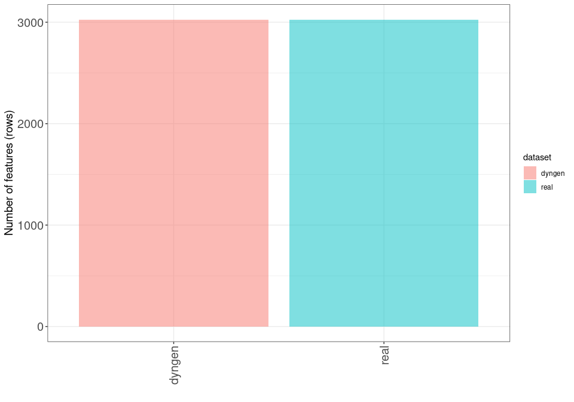<!-- -->

## Dispersion/BCV plots

Disperson/BCV plots show the association between the average abundance
and the dispersion or “biological coefficient of variation”
(sqrt(dispersion)), as calculated by
[`edgeR`](https://bioconductor.org/packages/release/bioc/html/edgeR.html)
(Robinson, McCarthy, and Smyth 2010) and
[`DESeq2`](http://bioconductor.org/packages/release/bioc/html/DESeq2.html)
(Love, Huber, and Anders 2014). In the `edgeR` plot, the estimate of the
prior degrees of freedom is indicated.

### edgeR

The black dots represent the tagwise dispersion estimates, the red line
the common dispersion and the blue curve represents the trended
dispersion estimates. For further information about the dispersion
estimation in `edgeR`, see Chen, Lun, and Smyth (2014).

``` r
ggplot(featureDF %>% dplyr::arrange(AveLogCPMDisp), 
       aes(x = AveLogCPMDisp, y = Tagwise)) + 
  geom_point(size = 0.25, alpha = 0.5) + 
  facet_wrap(~dataset, nrow = colRow[2]) + 
  geom_line(aes(y = Trend), color = "blue", size = 1.5) + 
  geom_line(aes(y = Common), color = "red", size = 1.5) +
  geom_text(data = datasetDF, aes(label = prior_df)) + 
  xlab("Average log CPM") + ylab("Biological coefficient of variation") + 
  thm
```

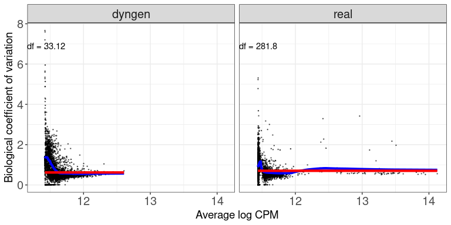<!-- -->

### DESeq2

The black dots are the gene-wise dispersion estimates, the red curve the
fitted mean-dispersion relationship and the blue circles represent the
final dispersion estimates.For further information about the dispersion
estimation in `DESeq2`, see Love, Huber, and Anders (2014).

``` r
ggplot(featureDF %>% dplyr::arrange(baseMeanDisp), 
       aes(x = baseMeanDisp, y = dispGeneEst)) + 
  geom_point(size = 0.25, alpha = 0.5) + 
  facet_wrap(~dataset, nrow = colRow[2]) + scale_x_log10() + scale_y_log10() +  
  geom_point(aes(y = dispFinal), color = "lightblue", shape = 21) + 
  geom_line(aes(y = dispFit), color = "red", size = 1.5) + 
  xlab("Base mean") + ylab("Dispersion") + 
  thm
```

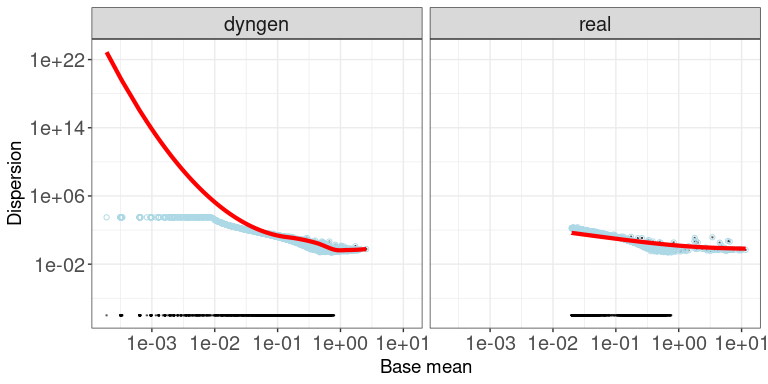<!-- -->

## Mean-variance plots

This scatter plot shows the relation between the empirical mean and
variance of the features. The difference between these mean-variance
plots and the mean-dispersion plots above is that the plots in this
section do not take the information about the experimental design and
sample grouping into account, but simply display the mean and variance
of log2(CPM) estimates across all samples, calculated using the `cpm`
function from
[`edgeR`](https://bioconductor.org/packages/release/bioc/html/edgeR.html)
(Robinson, McCarthy, and Smyth 2010), with a prior count of 2.

``` r
ggplot(featureDF, aes(x = average_log2_cpm, y = variance_log2_cpm)) + 
  geom_point(size = 0.75, alpha = 0.5) + 
  facet_wrap(~dataset, nrow = colRow[2]) + 
  xlab("Mean of log2(CPM)") + ylab("Variance of log2(CPM)") + 
  thm
```

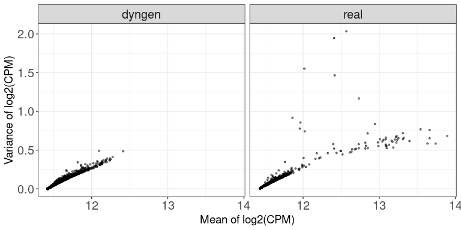<!-- -->

## Library sizes

This plot shows a histogram of the total read count per sample, i.e.,
the column sums of the respective data matrices.

``` r
ggplot(sampleDF, aes(x = Libsize)) + geom_histogram(bins = 30) + 
  facet_wrap(~dataset, nrow = colRow[2]) +
  xlab("Library size") + thm
```

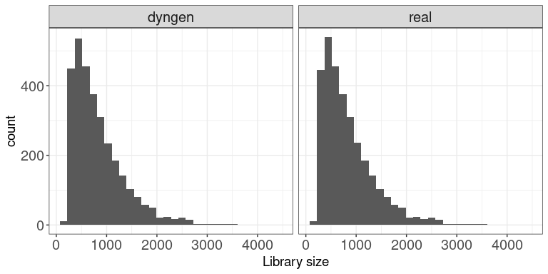<!-- -->

## TMM normalization factors

This plot shows a histogram of the TMM normalization factors (Robinson
and Oshlack 2010), intended to adjust for differences in RNA
composition, as calculated by
[`edgeR`](https://bioconductor.org/packages/release/bioc/html/edgeR.html)
(Robinson, McCarthy, and Smyth 2010).

``` r
ggplot(sampleDF, aes(x = TMM)) + geom_histogram(bins = 30) + 
  facet_wrap(~dataset, nrow = colRow[2]) +
  xlab("TMM normalization factor") + thm
```

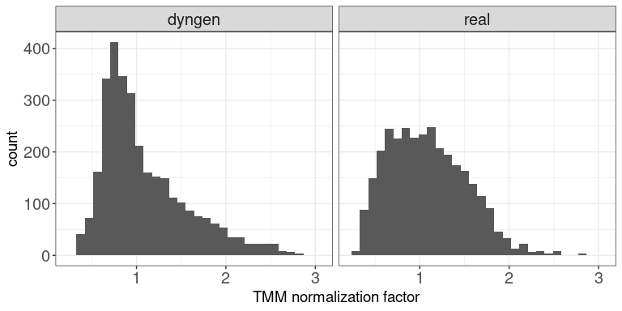<!-- -->

## Effective library sizes

This plot shows a histogram of the “effective library sizes,” defined as
the total count per sample multiplied by the corresponding TMM
normalization factor.

``` r
ggplot(sampleDF, aes(x = EffLibsize)) + geom_histogram(bins = 30) + 
  facet_wrap(~dataset, nrow = colRow[2]) +
  xlab("Effective library size") + thm
```

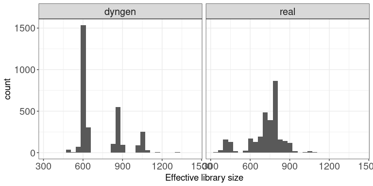<!-- -->

## Expression distributions (average log CPM)

This plot shows the distribution of average abundance values for the
features. The abundances are log CPM values calculated by `edgeR`.

``` r
ggplot(featureDF, aes(x = AveLogCPM)) + geom_histogram(bins = 30) + 
  facet_wrap(~dataset, nrow = colRow[2]) +
  xlab("Average log CPM") + thm
```

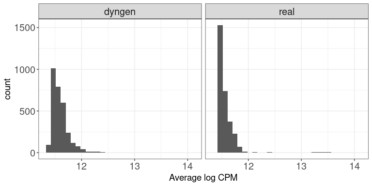<!-- -->

## Fraction zeros per sample

This plot shows the distribution of the fraction of zeros observed per
sample (column) in the count matrices.

``` r
ggplot(sampleDF, aes(x = Fraczero)) + geom_histogram(bins = 30) + 
  facet_wrap(~dataset, nrow = colRow[2]) +
  xlab("Fraction zeros per sample") + thm
```

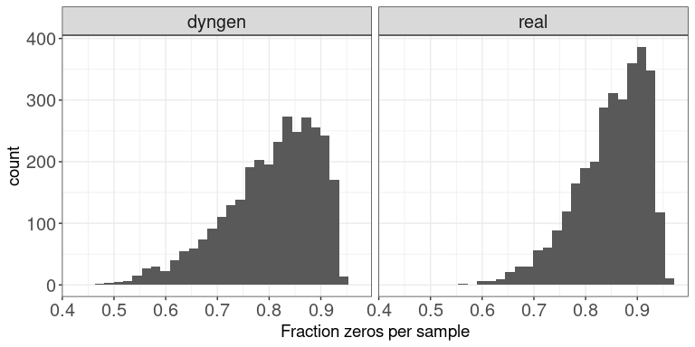<!-- -->

## Fraction zeros per feature

This plot illustrates the distribution of the fraction of zeros observed
per feature (row) in the count matrices.

``` r
ggplot(featureDF, aes(x = Fraczero)) + geom_histogram(bins = 30) + 
  facet_wrap(~dataset, nrow = colRow[2]) +
  xlab("Fraction zeros per feature") + thm
```

<!-- -->

## Sample-sample correlations

The plot below shows the distribution of Spearman correlation
coefficients for pairs of samples, calculated from the log(CPM) values
obtained via the `cpm` function from `edgeR`, with a prior.count of 2.

``` r
ggplot(sampleCorrDF, aes(x = Correlation)) + geom_histogram(bins = 30) + 
  facet_wrap(~dataset, nrow = colRow[2]) +
  xlab("Sample-sample correlation") + thm
```

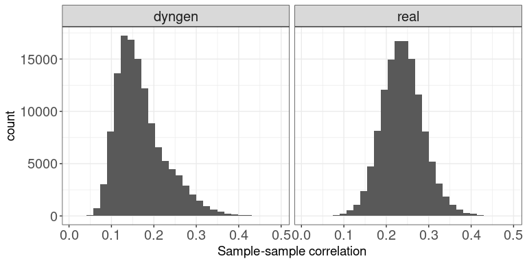<!-- -->

## Feature-feature correlations

This plot illustrates the distribution of Spearman correlation
coefficients for pairs of features, calculated from the log(CPM) values
obtained via the `cpm` function from `edgeR`, with a prior.count of 2.
Only non-constant features are considered.

``` r
ggplot(featureCorrDF, aes(x = Correlation)) + geom_histogram(bins = 30) + 
  facet_wrap(~dataset, nrow = colRow[2]) +
  xlab("Feature-feature correlation") + thm
```

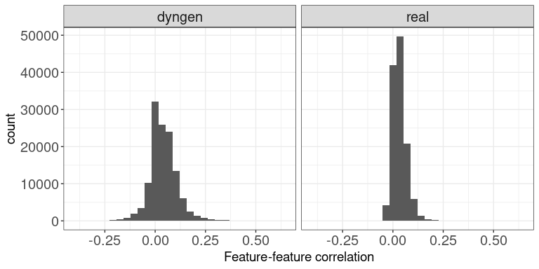<!-- -->

## Library size vs fraction zeros

This scatter plot shows the association between the total count (column
sums) and the fraction of zeros observed per sample.

``` r
ggplot(sampleDF, aes(x = Libsize, y = Fraczero)) + 
  geom_point(size = 1, alpha = 0.5) + 
  facet_wrap(~dataset, nrow = colRow[2]) + 
  xlab("Library size") + ylab("Fraction zeros") + thm
```

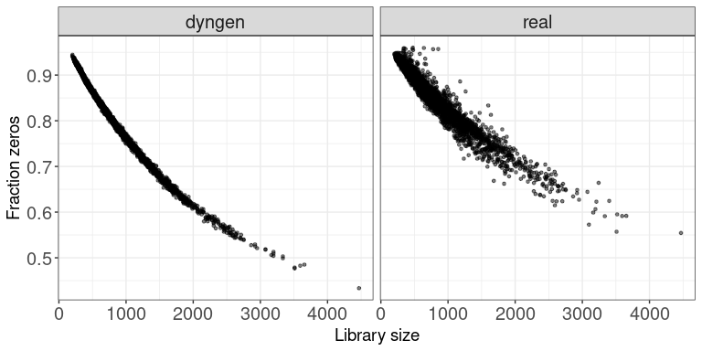<!-- -->

## Mean expression vs fraction zeros

This scatter plot shows the association between the average abundance
and the fraction of zeros observed per feature. The abundance is defined
as the log(CPM) values as calculated by `edgeR`.

``` r
ggplot(featureDF, aes(x = AveLogCPM, y = Fraczero)) + 
  geom_point(size = 0.75, alpha = 0.5) + 
  facet_wrap(~dataset, nrow = colRow[2]) + 
  xlab("Average log CPM") + ylab("Fraction zeros") + thm
```

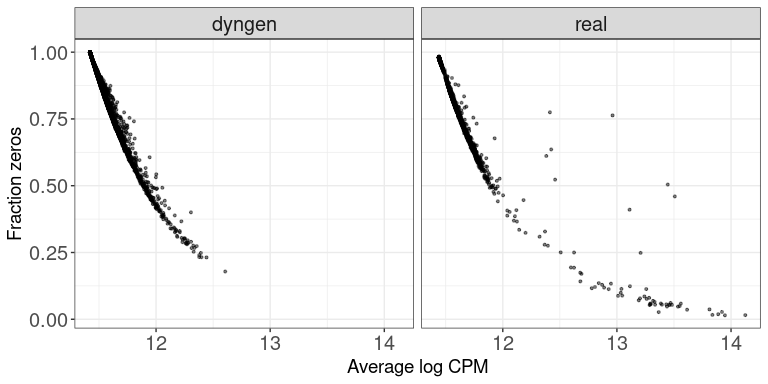<!-- -->

## References

<div id="refs" class="references csl-bib-body hanging-indent">

<div id="ref-Chen2014Dispersion" class="csl-entry">

Chen, Yunshun, Aaron TL Lun, and Gordon K Smyth. 2014. “Differential
Expression Analysis of Complex RNA-Seq Experiments Using edgeR.” *In
Statistical Analysis of Next Generation Sequence Data. Somnath Datta and
Daniel S Nettleton (Eds), Springer, New York*.
<https://doi.org/10.1007/978-3-319-07212-8_3>.

</div>

<div id="ref-Kolmogorov1933" class="csl-entry">

Kolmogorov, Andrey. 1933. “Sulla Determinazione Empirica Di Una Legge Di
Distribuzione.” *Giornale Dell’Istituto Italiano Degli Attuari* 4:
83–91.

</div>

<div id="ref-Love2014DESeq2" class="csl-entry">

Love, Michael I, Wolfgang Huber, and Simon Anders. 2014. “Moderated
Estimation of Fold Change and Dispersion for RNA-Seq Data with DESeq2.”
*Genome Biology* 15: 550. <https://doi.org/10.1186/s13059-014-0550-8>.

</div>

<div id="ref-Robinson2010edgeR" class="csl-entry">

Robinson, Mark D, Davis J McCarthy, and Gordon K Smyth. 2010. “edgeR: A
Bioconductor Package for Differential Expression Analysis of Digital
Gene Expression Data.” *Bioinformatics* 26: 139–40.
<https://doi.org/10.1093/bioinformatics/btp616>.

</div>

<div id="ref-Robinson2010TMM" class="csl-entry">

Robinson, Mark D, and Alicia Oshlack. 2010. “A Scaling Normalization
Method for Differential Expression Analysis of RNA-Seq Data.” *Genome
Biology* 11: R25. <https://doi.org/10.1186/gb-2010-11-3-r25>.

</div>

<div id="ref-Rousseeuw1987silhouette" class="csl-entry">

Rousseeuw, Peter J. 1987. “Silhouettes a Graphical Aid to the
Interpretation and Validation of Cluster Analysis.” *Journal of
Computational and Applied Mathematics*, 53–65.
<https://doi.org/10.1016/0377-0427(87)90125-7>.

</div>

<div id="ref-Smirnov1948" class="csl-entry">

Smirnov, Nikolai Vasilyevich. 1948. “Table for Estimating the Goodness
of Fit of Empirical Distributions.” *Annals of Mathematical Statistics*
19: 279–81. <https://doi.org/10.1214/aoms/1177730256>.

</div>

<div id="ref-Soneson2018" class="csl-entry">

Soneson, CharlotteI, and Mark D Robinson. 2018. “Towards Unified Quality
Verification of Synthetic Count Data with countsimQC.” *Bioinformatics*
34: 691–92. <https://doi.org/10.1093/bioinformatics/btx631>.

</div>

<div id="ref-WaldWolfowitz1940" class="csl-entry">

Wald, Abraham, and Jacob Wolfowitz. 1940. “On a Test Whether Two Samples
Are from the Same Population.” *The Annals of Mathematical Statistics*
11: 147–62. <https://doi.org/10.1214/aoms/1177731909>.

</div>

</div>
