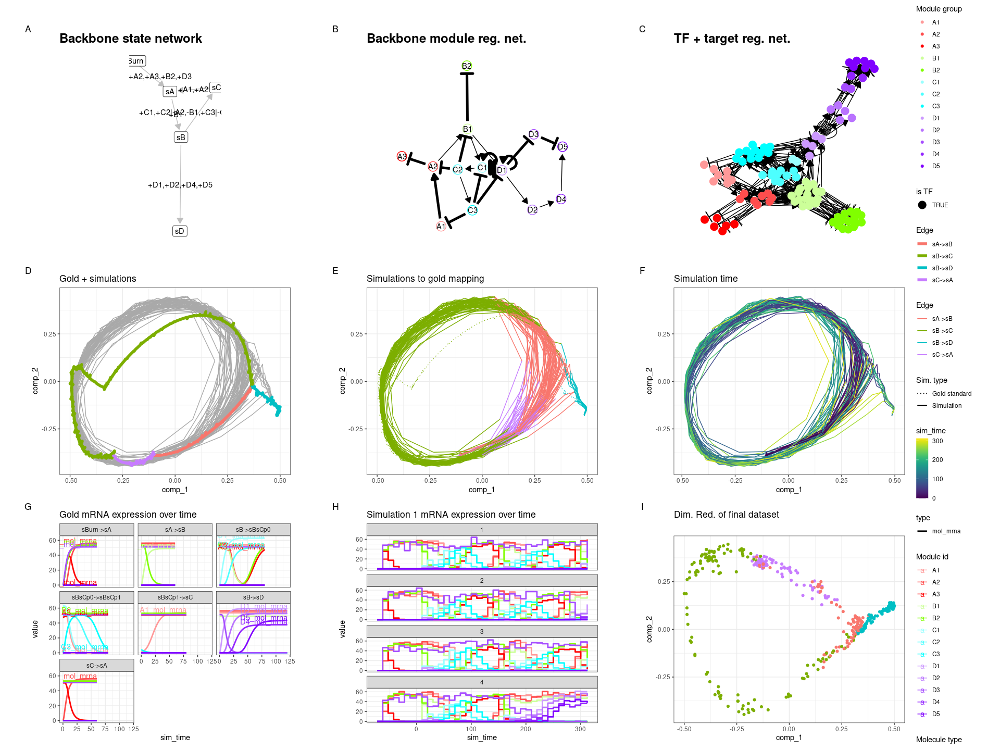
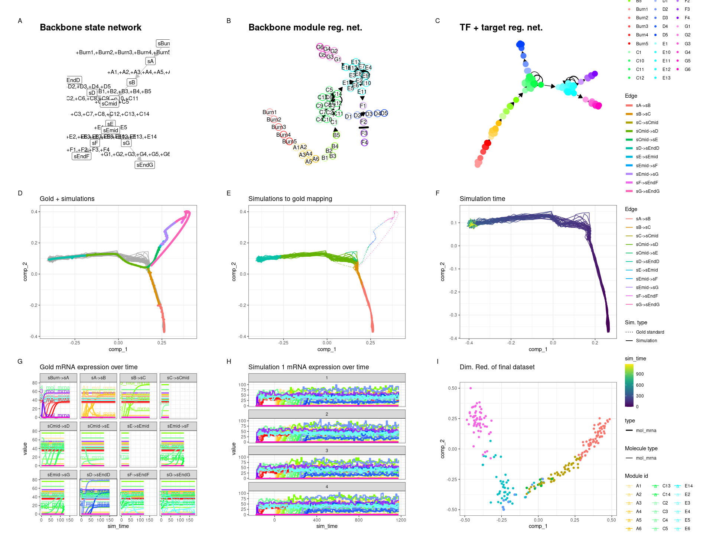
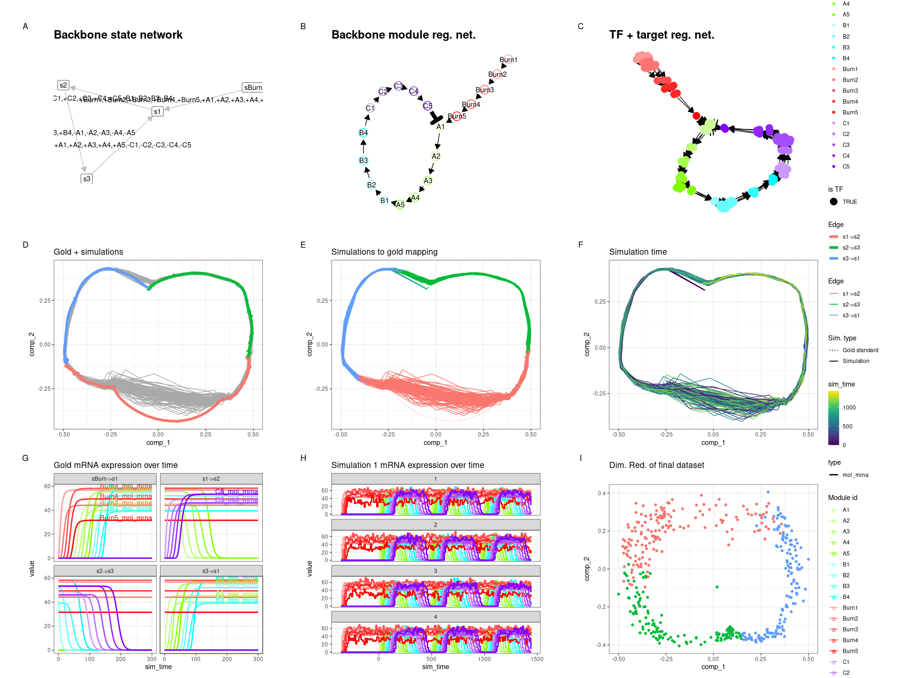
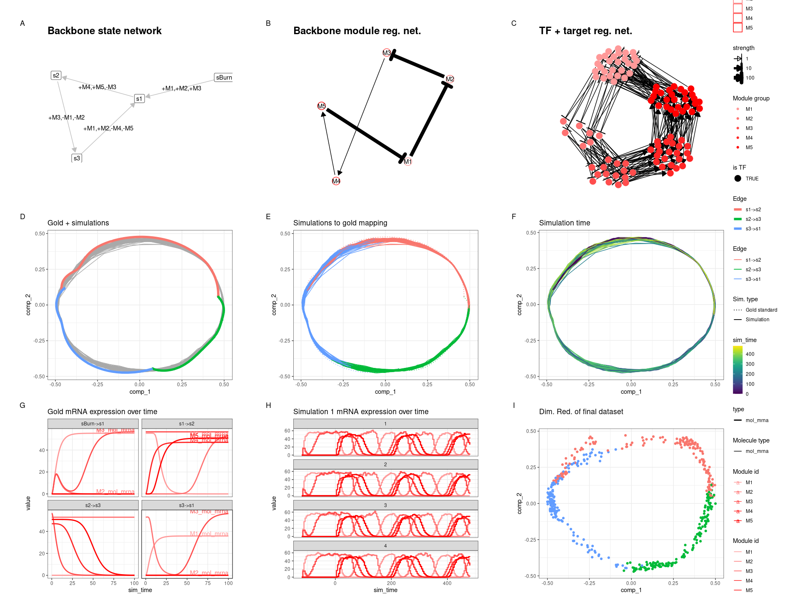

Showcase different backbones
================

<!-- github markdown built using 
rmarkdown::render("vignettes/showcase_backbones.Rmd", output_format = "github_document")
-->

``` r
library(dyngen)
```

dyngen supports different trajectory topologies, such as bifurcating and
cyclic. You can find a full list of backbones using `?list_backbones`.
This vignette will showcase each of them individually.

# Linear

``` r
backbone <- backbone_linear()

init <- initialise_model(
  backbone = backbone,
  num_cells = 500,
  num_tfs = 100,
  num_targets = 50,
  num_hks = 25,
  simulation_params = simulation_default(census_interval = 10, ssa_algorithm = ssa_etl(tau = 300 / 3600)),
  download_cache_dir = "~/.cache/dyngen/",
  num_cores = 7
)
out <- generate_dataset(init, make_plots = TRUE)
#> Generating TF network
#> Sampling feature network from real network
#> Generating kinetics for 175 features
#> Generating formulae
#> Generating gold standard mod changes
#> Precompiling reactions for gold standard
#> Running gold simulations
#>   |                                                  | 0 % elapsed=00s     |=============                                     | 25% elapsed=00s, remaining~01s  |=========================                         | 50% elapsed=01s, remaining~01s  |======================================            | 75% elapsed=01s, remaining~00s  |==================================================| 100% elapsed=02s, remaining~00s
#> Precompiling reactions for simulations
#> Running 32 simulations
#> Mapping simulations to gold standard
#> Performing dimred
#> Simulating experiment
#> Wrapping dataset
#> Making plots
out$plot
```

<!-- -->

# Bifurcating

``` r
backbone <- backbone_bifurcating()

init <- initialise_model(
  backbone = backbone,
  num_cells = 500,
  num_tfs = 100,
  num_targets = 50,
  num_hks = 25,
  simulation_params = simulation_default(census_interval = 10, ssa_algorithm = ssa_etl(tau = 300 / 3600)),
  download_cache_dir = "~/.cache/dyngen/",
  num_cores = 7
)
out <- generate_dataset(init, make_plots = TRUE)
#> Generating TF network
#> Sampling feature network from real network
#> Generating kinetics for 175 features
#> Generating formulae
#> Generating gold standard mod changes
#> Precompiling reactions for gold standard
#> Running gold simulations
#>   |                                                  | 0 % elapsed=00s     |========                                          | 14% elapsed=01s, remaining~03s  |===============                                   | 29% elapsed=01s, remaining~03s  |======================                            | 43% elapsed=01s, remaining~02s  |=============================                     | 57% elapsed=02s, remaining~01s  |====================================              | 71% elapsed=02s, remaining~01s  |===========================================       | 86% elapsed=02s, remaining~00s  |==================================================| 100% elapsed=03s, remaining~00s
#> Precompiling reactions for simulations
#> Running 32 simulations
#> Mapping simulations to gold standard
#> Performing dimred
#> Simulating experiment
#> Wrapping dataset
#> Making plots
out$plot
```

<!-- -->

# Bifurcating converging

``` r
backbone <- backbone_bifurcating_converging()

init <- initialise_model(
  backbone = backbone,
  num_cells = 500,
  num_tfs = 100,
  num_targets = 50,
  num_hks = 25,
  simulation_params = simulation_default(census_interval = 10, ssa_algorithm = ssa_etl(tau = 300 / 3600)),
  download_cache_dir = "~/.cache/dyngen/",
  num_cores = 7
)
out <- generate_dataset(init, make_plots = TRUE)
#> Generating TF network
#> Sampling feature network from real network
#> Generating kinetics for 175 features
#> Generating formulae
#> Generating gold standard mod changes
#> Precompiling reactions for gold standard
#> Running gold simulations
#>   |                                                  | 0 % elapsed=00s     |========                                          | 14% elapsed=00s, remaining~01s  |===============                                   | 29% elapsed=00s, remaining~01s  |======================                            | 43% elapsed=00s, remaining~01s  |=============================                     | 57% elapsed=01s, remaining~00s  |====================================              | 71% elapsed=01s, remaining~00s  |===========================================       | 86% elapsed=01s, remaining~00s  |==================================================| 100% elapsed=02s, remaining~00s
#> Precompiling reactions for simulations
#> Running 32 simulations
#> Mapping simulations to gold standard
#> Performing dimred
#> Simulating experiment
#> Wrapping dataset
#> Making plots
out$plot
```

<!-- -->

# Bifurcating cycle

``` r
backbone <- backbone_bifurcating_cycle()

init <- initialise_model(
  backbone = backbone,
  num_cells = 500,
  num_tfs = 100,
  num_targets = 50,
  num_hks = 25,
  simulation_params = simulation_default(census_interval = 10, ssa_algorithm = ssa_etl(tau = 300 / 3600)),
  download_cache_dir = "~/.cache/dyngen/",
  num_cores = 7
)
out <- generate_dataset(init, make_plots = TRUE)
#> Generating TF network
#> Sampling feature network from real network
#> Generating kinetics for 175 features
#> Generating formulae
#> Generating gold standard mod changes
#> Precompiling reactions for gold standard
#> Running gold simulations
#>   |                                                  | 0 % elapsed=00s     |=======                                           | 12% elapsed=00s, remaining~01s  |=============                                     | 25% elapsed=00s, remaining~01s  |===================                               | 38% elapsed=01s, remaining~01s  |=========================                         | 50% elapsed=01s, remaining~01s  |================================                  | 62% elapsed=01s, remaining~01s  |======================================            | 75% elapsed=02s, remaining~01s  |============================================      | 88% elapsed=02s, remaining~00s  |==================================================| 100% elapsed=02s, remaining~00s
#> Precompiling reactions for simulations
#> Running 32 simulations
#> Mapping simulations to gold standard
#> Performing dimred
#> Simulating experiment
#> Wrapping dataset
#> Making plots
out$plot
```

<!-- -->

# Bifurcating loop

``` r
backbone <- backbone_bifurcating_loop()

init <- initialise_model(
  backbone = backbone,
  num_cells = 500,
  num_tfs = 100,
  num_targets = 50,
  num_hks = 25,
  simulation_params = simulation_default(census_interval = 10, ssa_algorithm = ssa_etl(tau = 300 / 3600)),
  download_cache_dir = "~/.cache/dyngen/",
  num_cores = 7
)
out <- generate_dataset(init, make_plots = TRUE)
#> Generating TF network
#> Sampling feature network from real network
#> Generating kinetics for 175 features
#> Generating formulae
#> Generating gold standard mod changes
#> Precompiling reactions for gold standard
#> Running gold simulations
#>   |                                                  | 0 % elapsed=00s     |========                                          | 14% elapsed=00s, remaining~01s  |===============                                   | 29% elapsed=00s, remaining~01s  |======================                            | 43% elapsed=01s, remaining~01s  |=============================                     | 57% elapsed=01s, remaining~01s  |====================================              | 71% elapsed=01s, remaining~00s  |===========================================       | 86% elapsed=01s, remaining~00s  |==================================================| 100% elapsed=02s, remaining~00s
#> Precompiling reactions for simulations
#> Running 32 simulations
#> Mapping simulations to gold standard
#> Performing dimred
#> Simulating experiment
#> Wrapping dataset
#> Making plots
out$plot
```

<!-- -->

# Binary tree

``` r
backbone <- backbone_binary_tree(
  num_modifications = 2
)

init <- initialise_model(
  backbone = backbone,
  num_cells = 500,
  num_tfs = 100,
  num_targets = 50,
  num_hks = 25,
  simulation_params = simulation_default(census_interval = 10, ssa_algorithm = ssa_etl(tau = 300 / 3600)),
  download_cache_dir = "~/.cache/dyngen/",
  num_cores = 7
)
out <- generate_dataset(init, make_plots = TRUE)
#> Generating TF network
#> Sampling feature network from real network
#> Generating kinetics for 175 features
#> Generating formulae
#> Generating gold standard mod changes
#> Precompiling reactions for gold standard
#> Running gold simulations
#>   |                                                  | 0 % elapsed=00s     |=====                                             | 8 % elapsed=00s, remaining~04s  |=========                                         | 17% elapsed=01s, remaining~04s  |=============                                     | 25% elapsed=01s, remaining~04s  |=================                                 | 33% elapsed=01s, remaining~03s  |=====================                             | 42% elapsed=02s, remaining~02s  |=========================                         | 50% elapsed=02s, remaining~02s  |==============================                    | 58% elapsed=02s, remaining~02s  |==================================                | 67% elapsed=02s, remaining~01s  |======================================            | 75% elapsed=03s, remaining~01s  |==========================================        | 83% elapsed=03s, remaining~01s  |==============================================    | 92% elapsed=04s, remaining~00s  |==================================================| 100% elapsed=04s, remaining~00s
#> Precompiling reactions for simulations
#> Running 32 simulations
#> Mapping simulations to gold standard
#> Warning in .generate_cells_predict_state(model): Simulation does not contain all gold standard edges. This simulation likely suffers from bad
#> kinetics; choose a different seed and rerun.
#> Performing dimred
#> Simulating experiment
#> Wrapping dataset
#> Making plots
out$plot
```

<!-- -->

# Branching

``` r
backbone <- backbone_branching(
  num_modifications = 2,
  min_degree = 3,
  max_degree = 3
)

init <- initialise_model(
  backbone = backbone,
  num_cells = 500,
  num_tfs = 100,
  num_targets = 50,
  num_hks = 25,
  simulation_params = simulation_default(census_interval = 10, ssa_algorithm = ssa_etl(tau = 300 / 3600)),
  download_cache_dir = "~/.cache/dyngen/",
  num_cores = 7
)
out <- generate_dataset(init, make_plots = TRUE)
#> Generating TF network
#> Sampling feature network from real network
#> Generating kinetics for 175 features
#> Generating formulae
#> Generating gold standard mod changes
#> Precompiling reactions for gold standard
#> Running gold simulations
#>   |                                                  | 0 % elapsed=00s     |=====                                             | 8 % elapsed=00s, remaining~05s  |=========                                         | 17% elapsed=01s, remaining~05s  |=============                                     | 25% elapsed=01s, remaining~04s  |=================                                 | 33% elapsed=02s, remaining~03s  |=====================                             | 42% elapsed=02s, remaining~03s  |=========================                         | 50% elapsed=02s, remaining~02s  |==============================                    | 58% elapsed=02s, remaining~02s  |==================================                | 67% elapsed=03s, remaining~01s  |======================================            | 75% elapsed=03s, remaining~01s  |==========================================        | 83% elapsed=04s, remaining~01s  |==============================================    | 92% elapsed=04s, remaining~00s  |==================================================| 100% elapsed=04s, remaining~00s
#> Precompiling reactions for simulations
#> Running 32 simulations
#> Mapping simulations to gold standard
#> Performing dimred
#> Simulating experiment
#> Wrapping dataset
#> Making plots
out$plot
```

<!-- -->

# Consecutive bifurcating

``` r
backbone <- backbone_consecutive_bifurcating()

init <- initialise_model(
  backbone = backbone,
  num_cells = 500,
  num_tfs = 100,
  num_targets = 50,
  num_hks = 25,
  simulation_params = simulation_default(census_interval = 10, ssa_algorithm = ssa_etl(tau = 300 / 3600)),
  download_cache_dir = "~/.cache/dyngen/",
  num_cores = 7
)
out <- generate_dataset(init, make_plots = TRUE)
#> Generating TF network
#> Sampling feature network from real network
#> Generating kinetics for 175 features
#> Generating formulae
#> Generating gold standard mod changes
#> Precompiling reactions for gold standard
#> Running gold simulations
#>   |                                                  | 0 % elapsed=00s     |=====                                             | 8 % elapsed=00s, remaining~04s  |=========                                         | 17% elapsed=01s, remaining~04s  |=============                                     | 25% elapsed=01s, remaining~04s  |=================                                 | 33% elapsed=01s, remaining~03s  |=====================                             | 42% elapsed=02s, remaining~02s  |=========================                         | 50% elapsed=02s, remaining~02s  |==============================                    | 58% elapsed=02s, remaining~02s  |==================================                | 67% elapsed=02s, remaining~01s  |======================================            | 75% elapsed=03s, remaining~01s  |==========================================        | 83% elapsed=03s, remaining~01s  |==============================================    | 92% elapsed=04s, remaining~00s  |==================================================| 100% elapsed=04s, remaining~00s
#> Precompiling reactions for simulations
#> Running 32 simulations
#> Mapping simulations to gold standard
#> Warning in .generate_cells_predict_state(model): Simulation does not contain all gold standard edges. This simulation likely suffers from bad
#> kinetics; choose a different seed and rerun.
#> Performing dimred
#> Simulating experiment
#> Wrapping dataset
#> Making plots
out$plot
```

<!-- -->

# Trifurcating

``` r
backbone <- backbone_trifurcating()

init <- initialise_model(
  backbone = backbone,
  num_cells = 500,
  num_tfs = 100,
  num_targets = 50,
  num_hks = 25,
  download_cache_dir = "~/.cache/dyngen/",
  num_cores = 7
)
out <- generate_dataset(init, make_plots = TRUE)
#> Generating TF network
#> Sampling feature network from real network
#> Generating kinetics for 175 features
#> Generating formulae
#> Generating gold standard mod changes
#> Precompiling reactions for gold standard
#> Running gold simulations
#>   |                                                  | 0 % elapsed=00s     |=====                                             | 10% elapsed=00s, remaining~03s  |==========                                        | 20% elapsed=01s, remaining~03s  |===============                                   | 30% elapsed=01s, remaining~02s  |====================                              | 40% elapsed=01s, remaining~02s  |=========================                         | 50% elapsed=02s, remaining~02s  |==============================                    | 60% elapsed=02s, remaining~01s  |===================================               | 70% elapsed=02s, remaining~01s  |========================================          | 80% elapsed=03s, remaining~01s  |=============================================     | 90% elapsed=03s, remaining~00s  |==================================================| 100% elapsed=04s, remaining~00s
#> Precompiling reactions for simulations
#> Running 32 simulations
#> Mapping simulations to gold standard
#> Warning in .generate_cells_predict_state(model): Simulation does not contain all gold standard edges. This simulation likely suffers from bad
#> kinetics; choose a different seed and rerun.
#> Performing dimred
#> Simulating experiment
#> Wrapping dataset
#> Making plots
out$plot
```

<!-- -->

# Converging

``` r
backbone <- backbone_converging()

init <- initialise_model(
  backbone = backbone,
  num_cells = 500,
  num_tfs = 100,
  num_targets = 50,
  num_hks = 25,
  simulation_params = simulation_default(census_interval = 10, ssa_algorithm = ssa_etl(tau = 300 / 3600)),
  download_cache_dir = "~/.cache/dyngen/",
  num_cores = 7
)
out <- generate_dataset(init, make_plots = TRUE)
#> Generating TF network
#> Sampling feature network from real network
#> Generating kinetics for 175 features
#> Generating formulae
#> Generating gold standard mod changes
#> Precompiling reactions for gold standard
#> Running gold simulations
#>   |                                                  | 0 % elapsed=00s     |=======                                           | 12% elapsed=00s, remaining~02s  |=============                                     | 25% elapsed=01s, remaining~02s  |===================                               | 38% elapsed=01s, remaining~01s  |=========================                         | 50% elapsed=01s, remaining~01s  |================================                  | 62% elapsed=01s, remaining~01s  |======================================            | 75% elapsed=02s, remaining~01s  |============================================      | 88% elapsed=02s, remaining~00s  |==================================================| 100% elapsed=03s, remaining~00s
#> Precompiling reactions for simulations
#> Running 32 simulations
#> Mapping simulations to gold standard
#> Performing dimred
#> Simulating experiment
#> Wrapping dataset
#> Making plots
out$plot
```

<!-- -->

# Cycle

``` r
backbone <- backbone_cycle()

init <- initialise_model(
  backbone = backbone,
  num_cells = 500,
  num_tfs = 100,
  num_targets = 50,
  num_hks = 25,
  simulation_params = simulation_default(census_interval = 10, ssa_algorithm = ssa_etl(tau = 300 / 3600)),
  download_cache_dir = "~/.cache/dyngen/",
  num_cores = 7
)
out <- generate_dataset(init, make_plots = TRUE)
#> Generating TF network
#> Sampling feature network from real network
#> Generating kinetics for 175 features
#> Generating formulae
#> Generating gold standard mod changes
#> Precompiling reactions for gold standard
#> Running gold simulations
#>   |                                                  | 0 % elapsed=00s     |=============                                     | 25% elapsed=01s, remaining~03s  |=========================                         | 50% elapsed=02s, remaining~02s  |======================================            | 75% elapsed=03s, remaining~01s  |==================================================| 100% elapsed=03s, remaining~00s
#> Precompiling reactions for simulations
#> Running 32 simulations
#> Mapping simulations to gold standard
#> Performing dimred
#> Simulating experiment
#> Wrapping dataset
#> Making plots
out$plot
```

<!-- -->

# Disconnected

``` r
backbone <- backbone_disconnected()

init <- initialise_model(
  backbone = backbone,
  num_cells = 500,
  num_tfs = 100,
  num_targets = 50,
  num_hks = 25,
  simulation_params = simulation_default(census_interval = 10, ssa_algorithm = ssa_etl(tau = 300 / 3600)),
  download_cache_dir = "~/.cache/dyngen/",
  num_cores = 7
)
out <- generate_dataset(init, make_plots = TRUE)
#> Generating TF network
#> Sampling feature network from real network
#> Generating kinetics for 183 features
#> Generating formulae
#> Generating gold standard mod changes
#> Precompiling reactions for gold standard
#> Running gold simulations
#>   |                                                  | 0 % elapsed=00s     |===                                               | 5 % elapsed=00s, remaining~06s  |=====                                             | 9 % elapsed=01s, remaining~06s  |=======                                           | 14% elapsed=01s, remaining~06s  |==========                                        | 18% elapsed=01s, remaining~06s  |============                                      | 23% elapsed=02s, remaining~05s  |==============                                    | 27% elapsed=02s, remaining~05s  |================                                  | 32% elapsed=02s, remaining~04s  |===================                               | 36% elapsed=02s, remaining~04s  |=====================                             | 41% elapsed=03s, remaining~04s  |=======================                           | 45% elapsed=03s, remaining~04s  |=========================                         | 50% elapsed=04s, remaining~04s  |============================                      | 55% elapsed=04s, remaining~03s  |==============================                    | 59% elapsed=05s, remaining~03s  |================================                  | 64% elapsed=05s, remaining~03s  |===================================               | 68% elapsed=05s, remaining~02s  |=====================================             | 73% elapsed=06s, remaining~02s  |=======================================           | 77% elapsed=06s, remaining~02s  |=========================================         | 82% elapsed=06s, remaining~01s  |============================================      | 86% elapsed=06s, remaining~01s  |==============================================    | 91% elapsed=07s, remaining~01s  |================================================  | 95% elapsed=07s, remaining~00s  |==================================================| 100% elapsed=08s, remaining~00s
#> Precompiling reactions for simulations
#> Running 32 simulations
#> Mapping simulations to gold standard
#> Performing dimred
#> Simulating experiment
#> Wrapping dataset
#> Making plots
out$plot
```

<!-- -->

# Linear simple

``` r
backbone <- backbone_linear_simple()

init <- initialise_model(
  backbone = backbone,
  num_cells = 500,
  num_tfs = 100,
  num_targets = 50,
  num_hks = 25,
  download_cache_dir = "~/.cache/dyngen/",
  num_cores = 7
)
out <- generate_dataset(init, make_plots = TRUE)
#> Generating TF network
#> Sampling feature network from real network
#> Generating kinetics for 175 features
#> Generating formulae
#> Generating gold standard mod changes
#> Precompiling reactions for gold standard
#> Running gold simulations
#>   |                                                  | 0 % elapsed=00s     |=========================                         | 50% elapsed=00s, remaining~00s  |==================================================| 100% elapsed=00s, remaining~00s
#> Precompiling reactions for simulations
#> Running 32 simulations
#> Mapping simulations to gold standard
#> Performing dimred
#> Simulating experiment
#> Wrapping dataset
#> Making plots
out$plot
```

<!-- -->

# Cycle simple

``` r
backbone <- backbone_cycle_simple()

init <- initialise_model(
  backbone = backbone,
  num_cells = 500,
  num_tfs = 100,
  num_targets = 50,
  num_hks = 25,
  download_cache_dir = "~/.cache/dyngen/",
  num_cores = 7
)
out <- generate_dataset(init, make_plots = TRUE)
#> Generating TF network
#> Sampling feature network from real network
#> Generating kinetics for 175 features
#> Generating formulae
#> Generating gold standard mod changes
#> Precompiling reactions for gold standard
#> Running gold simulations
#>   |                                                  | 0 % elapsed=00s     |=============                                     | 25% elapsed=00s, remaining~01s  |=========================                         | 50% elapsed=01s, remaining~01s  |======================================            | 75% elapsed=01s, remaining~00s  |==================================================| 100% elapsed=01s, remaining~00s
#> Precompiling reactions for simulations
#> Running 32 simulations
#> Mapping simulations to gold standard
#> Performing dimred
#> Simulating experiment
#> Wrapping dataset
#> Making plots
out$plot
```

<!-- -->
