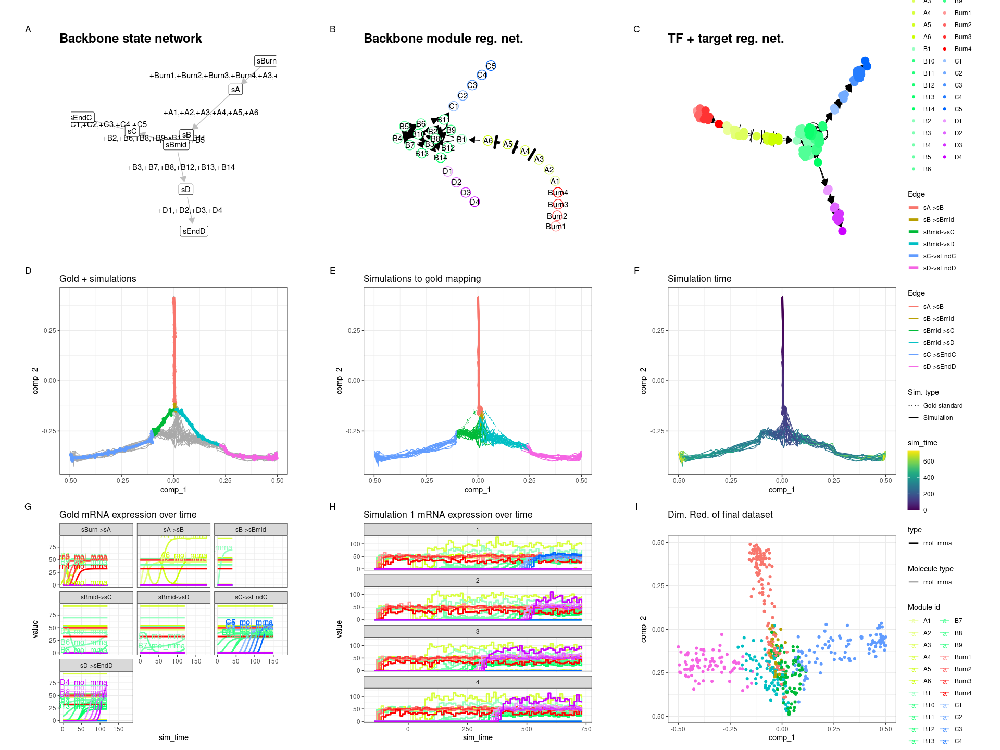
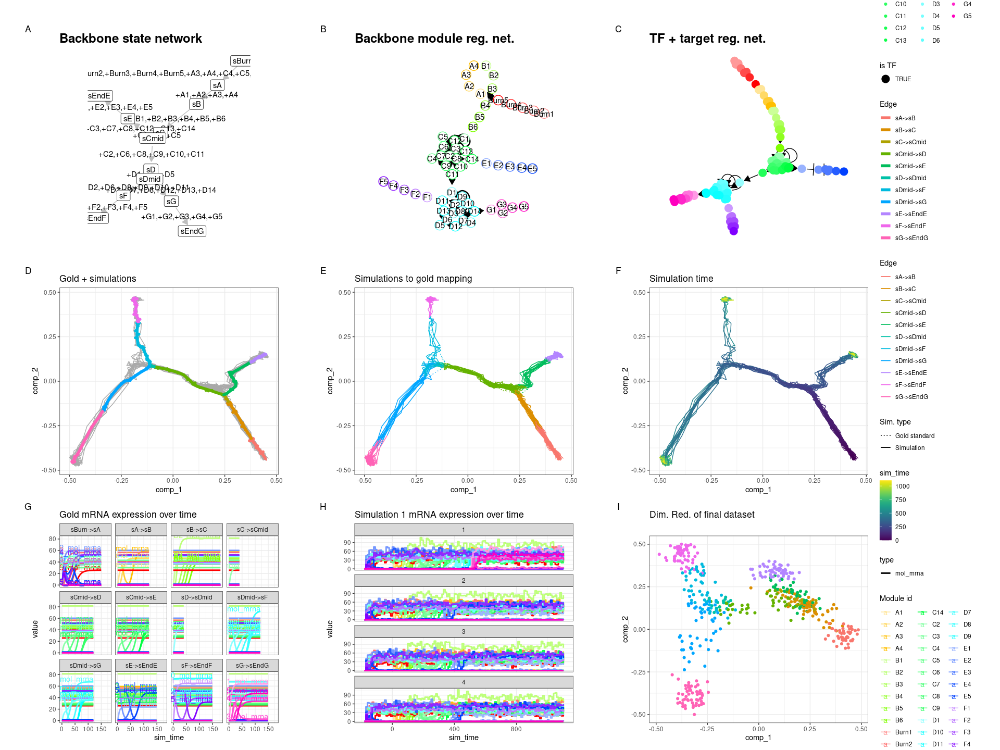
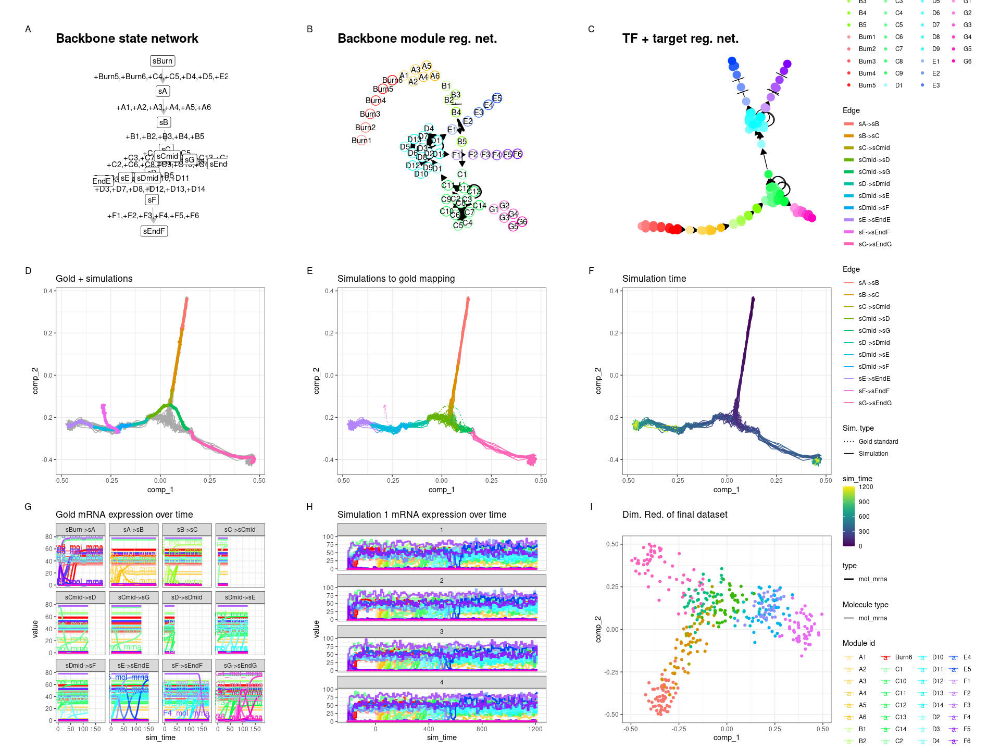
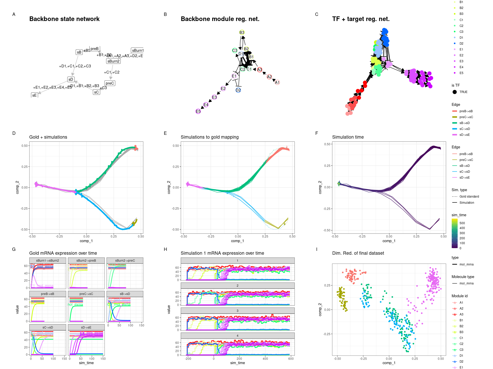
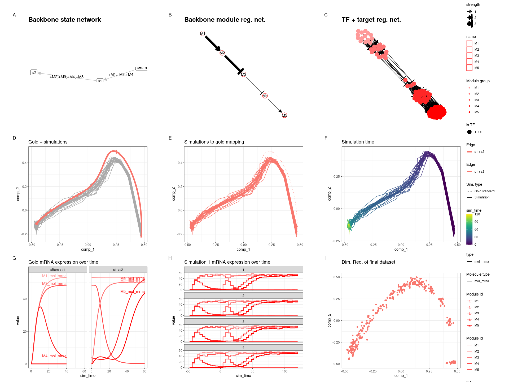

Showcase different backbones
================

<!-- github markdown built using 
rmarkdown::render("vignettes/showcase_backbones.Rmd", output_format = rmarkdown::github_document())
-->

``` r
library(dyngen)
```

This vignette demonstrates the different dynamic processes topologies
(e.g. bifurcating and cyclic). If you haven’t done so already, first
check out the installation instructions in the README.

You can find a full list of backbones using `?list_backbones`. This
vignette will showcase each of them individually.

# Linear

``` r
set.seed(1)

backbone <- backbone_linear()

init <- initialise_model(
  backbone = backbone,
  num_cells = 500,
  num_tfs = 100,
  num_targets = 50,
  num_hks = 25,
  simulation_params = simulation_default(census_interval = 10, ssa_algorithm = ssa_etl(tau = 300 / 3600)),
  verbose = FALSE
)
out <- generate_dataset(init, make_plots = TRUE)
out$plot
```

<!-- -->

# Bifurcating

``` r
set.seed(2)

backbone <- backbone_bifurcating()

init <- initialise_model(
  backbone = backbone,
  num_cells = 500,
  num_tfs = 100,
  num_targets = 50,
  num_hks = 25,
  simulation_params = simulation_default(census_interval = 10, ssa_algorithm = ssa_etl(tau = 300 / 3600)),
  verbose = FALSE
)
out <- generate_dataset(init, make_plots = TRUE)
out$plot
```

<!-- -->

# Bifurcating converging

``` r
set.seed(3)

backbone <- backbone_bifurcating_converging()

init <- initialise_model(
  backbone = backbone,
  num_cells = 500,
  num_tfs = 100,
  num_targets = 50,
  num_hks = 25,
  simulation_params = simulation_default(census_interval = 10, ssa_algorithm = ssa_etl(tau = 300 / 3600)),
  verbose = FALSE
)
out <- generate_dataset(init, make_plots = TRUE)
out$plot
```

<!-- -->

# Bifurcating cycle

``` r
set.seed(4)

backbone <- backbone_bifurcating_cycle()

init <- initialise_model(
  backbone = backbone,
  num_cells = 500,
  num_tfs = 100,
  num_targets = 50,
  num_hks = 25,
  simulation_params = simulation_default(census_interval = 10, ssa_algorithm = ssa_etl(tau = 300 / 3600)),
  verbose = FALSE
)
out <- generate_dataset(init, make_plots = TRUE)
out$plot
```

<!-- -->

# Bifurcating loop

``` r
set.seed(5)

backbone <- backbone_bifurcating_loop()

init <- initialise_model(
  backbone = backbone,
  num_cells = 500,
  num_tfs = 100,
  num_targets = 50,
  num_hks = 25,
  simulation_params = simulation_default(census_interval = 10, ssa_algorithm = ssa_etl(tau = 300 / 3600)),
  verbose = FALSE
)
out <- generate_dataset(init, make_plots = TRUE)
out$plot
```

<!-- -->

# Binary tree

``` r
set.seed(6)

backbone <- backbone_binary_tree(
  num_modifications = 2
)

init <- initialise_model(
  backbone = backbone,
  num_cells = 500,
  num_tfs = 100,
  num_targets = 50,
  num_hks = 25,
  simulation_params = simulation_default(census_interval = 10, ssa_algorithm = ssa_etl(tau = 300 / 3600)),
  verbose = FALSE
)
out <- generate_dataset(init, make_plots = TRUE)
out$plot
```

<!-- -->

# Branching

``` r
set.seed(7)

backbone <- backbone_branching(
  num_modifications = 2,
  min_degree = 3,
  max_degree = 3
)

init <- initialise_model(
  backbone = backbone,
  num_cells = 500,
  num_tfs = 100,
  num_targets = 50,
  num_hks = 25,
  simulation_params = simulation_default(census_interval = 10, ssa_algorithm = ssa_etl(tau = 300 / 3600)),
  verbose = FALSE
)
out <- generate_dataset(init, make_plots = TRUE)
#> Warning in .generate_cells_predict_state(model): Simulation does not contain all gold standard edges. This simulation likely suffers from bad kinetics; choose a different seed and rerun.
out$plot
```

<!-- -->

# Consecutive bifurcating

``` r
set.seed(8)

backbone <- backbone_consecutive_bifurcating()

init <- initialise_model(
  backbone = backbone,
  num_cells = 500,
  num_tfs = 100,
  num_targets = 50,
  num_hks = 25,
  simulation_params = simulation_default(census_interval = 10, ssa_algorithm = ssa_etl(tau = 300 / 3600)),
  verbose = FALSE
)
out <- generate_dataset(init, make_plots = TRUE)
#> Warning in .generate_cells_predict_state(model): Simulation does not contain all gold standard edges. This simulation likely suffers from bad kinetics; choose a different seed and rerun.
out$plot
```

<!-- -->

# Trifurcating

``` r
set.seed(9)

backbone <- backbone_trifurcating()

init <- initialise_model(
  backbone = backbone,
  num_cells = 500,
  num_tfs = 100,
  num_targets = 50,
  num_hks = 25,
  verbose = FALSE
)
out <- generate_dataset(init, make_plots = TRUE)
out$plot
```

<!-- -->

# Converging

``` r
set.seed(10)

backbone <- backbone_converging()

init <- initialise_model(
  backbone = backbone,
  num_cells = 500,
  num_tfs = 100,
  num_targets = 50,
  num_hks = 25,
  simulation_params = simulation_default(census_interval = 10, ssa_algorithm = ssa_etl(tau = 300 / 3600)),
  verbose = FALSE
)
out <- generate_dataset(init, make_plots = TRUE)
out$plot
```

<!-- -->

# Cycle

``` r
set.seed(11)

backbone <- backbone_cycle()

init <- initialise_model(
  backbone = backbone,
  num_cells = 500,
  num_tfs = 100,
  num_targets = 50,
  num_hks = 25,
  simulation_params = simulation_default(census_interval = 10, ssa_algorithm = ssa_etl(tau = 300 / 3600)),
  verbose = FALSE
)
out <- generate_dataset(init, make_plots = TRUE)
out$plot
```

<!-- -->

# Disconnected

``` r
set.seed(12)

backbone <- backbone_disconnected()

init <- initialise_model(
  backbone = backbone,
  num_cells = 500,
  num_tfs = 100,
  num_targets = 50,
  num_hks = 25,
  simulation_params = simulation_default(census_interval = 10, ssa_algorithm = ssa_etl(tau = 300 / 3600)),
  verbose = FALSE
)
out <- generate_dataset(init, make_plots = TRUE)
#> Warning in .generate_cells_predict_state(model): Simulation does not contain all gold standard edges. This simulation likely suffers from bad kinetics; choose a different seed and rerun.
out$plot
```

<!-- -->

# Linear simple

``` r
set.seed(13)

backbone <- backbone_linear_simple()

init <- initialise_model(
  backbone = backbone,
  num_cells = 500,
  num_tfs = 100,
  num_targets = 50,
  num_hks = 25,
  verbose = FALSE
)
out <- generate_dataset(init, make_plots = TRUE)
out$plot
```

<!-- -->

# Cycle simple

``` r
set.seed(14)

backbone <- backbone_cycle_simple()

init <- initialise_model(
  backbone = backbone,
  num_cells = 500,
  num_tfs = 100,
  num_targets = 50,
  num_hks = 25,
  verbose = FALSE
)
out <- generate_dataset(init, make_plots = TRUE)
out$plot
```

<!-- -->
